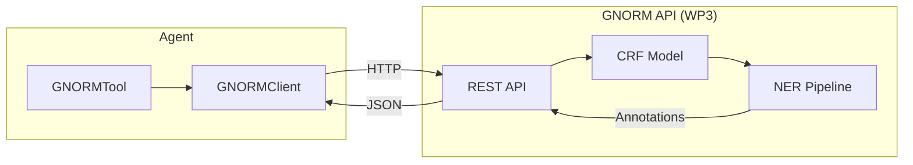
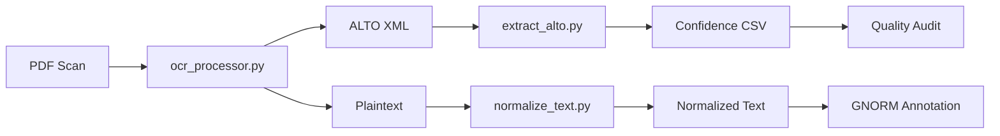

# GNORM Integration

Integration with the GNORM CRF-based annotation system from ITSERR WP3.

## Overview

GNORM (Generic NORmalization of Medieval texts) provides named entity recognition for religious and historical texts. The ITSERR Agent integrates GNORM annotations with epistemic indicators.

!!! note "API Status"

    API details are pending confirmation during the technical briefing (Feb 11-12, 2026). The current implementation uses placeholder endpoints.

## Architecture



## Components

### GNORMClient

Async HTTP client for the GNORM API:

```python
class GNORMClient:
    def __init__(self, config: AgentConfig) -> None:
        self.config = config
        self._client: httpx.AsyncClient | None = None

    async def __aenter__(self) -> "GNORMClient":
        """Enter async context manager."""
        return self

    async def __aexit__(self, exc_type, exc_val, exc_tb) -> None:
        """Exit async context manager, ensuring cleanup."""
        await self.close()

    async def annotate(
        self,
        text: str,
        entity_types: list[str] | None = None,
        language: str = "en",
    ) -> GNORMResponse:
        """Request annotations for a text."""
        ...
```

**Usage:**

```python
async with GNORMClient(config) as client:
    response = await client.annotate(
        text="Augustine wrote Confessions in 397 CE.",
        entity_types=["person", "work", "date"]
    )
```

### GNORMAnnotation

Data class for individual annotations:

```python
@dataclass
class GNORMAnnotation:
    entity_text: str      # "Augustine"
    entity_type: str      # "person"
    start_offset: int     # 0
    end_offset: int       # 9
    confidence: float     # 0.92
    metadata: dict | None # Additional data

    def get_epistemic_indicator(
        self,
        high_confidence_threshold: float = 0.85
    ) -> IndicatorType:
        """Map confidence to epistemic indicator."""
        if self.confidence >= high_confidence_threshold:
            return IndicatorType.FACTUAL
        else:
            return IndicatorType.INTERPRETIVE
```

### GNORMTool

Tool wrapper following the human-centered tool pattern:

```python
class GNORMTool(BaseTool):
    @property
    def name(self) -> str:
        return "gnorm_annotate"

    @property
    def category(self) -> ToolCategory:
        return ToolCategory.EXTERNAL  # Requires confirmation

    async def execute(self, **kwargs) -> ToolResult:
        text = kwargs.get("text", "")
        entity_types = kwargs.get("entity_types")

        response = await self._gnorm_client.annotate(
            text=text,
            entity_types=entity_types,
        )

        threshold = self._gnorm_client.config.high_confidence_threshold

        return ToolResult(
            success=True,
            data={
                "annotations": [
                    {
                        "text": a.entity_text,
                        "type": a.entity_type,
                        "confidence": a.confidence,
                        "indicator": a.get_epistemic_indicator(threshold).value,
                    }
                    for a in response.annotations
                ],
                "count": len(response.annotations),
            },
            tool_name=self.name,
            category=self.category,
        )
```

## Epistemic Mapping

GNORM confidence scores map to epistemic indicators:

| Confidence | Indicator | Rationale |
|------------|-----------|-----------|
| ≥ 85% | `[FACTUAL]` | High-confidence NER is reliable |
| < 85% | `[INTERPRETIVE]` | Requires researcher verification |

### Configurable Threshold

```python
# In config or .env
HIGH_CONFIDENCE_THRESHOLD=0.85

# Usage
threshold = config.high_confidence_threshold
indicator = annotation.get_epistemic_indicator(threshold)
```

## API Specification (Placeholder)

### Annotate Endpoint

**Request:**

```http
POST /annotate
Content-Type: application/json
Authorization: Bearer <api_key>

{
    "text": "Augustine wrote Confessions in 397 CE.",
    "language": "en",
    "entity_types": ["person", "work", "date"]
}
```

**Response:**

```json
{
    "text_id": "abc123",
    "processing_time_ms": 45.2,
    "model_version": "gnorm-crf-1.0",
    "annotations": [
        {
            "text": "Augustine",
            "type": "person",
            "start": 0,
            "end": 9,
            "confidence": 0.92,
            "metadata": {
                "canonical_name": "Augustine of Hippo",
                "viaf_id": "66806872"
            }
        },
        {
            "text": "Confessions",
            "type": "work",
            "start": 16,
            "end": 27,
            "confidence": 0.88,
            "metadata": {
                "original_title": "Confessiones"
            }
        },
        {
            "text": "397 CE",
            "type": "date",
            "start": 31,
            "end": 37,
            "confidence": 0.95,
            "metadata": {
                "normalized": "0397"
            }
        }
    ]
}
```

## Error Handling

```python
class GNORMError(Exception):
    """Exception raised for GNORM API errors."""
    pass

try:
    response = await client.annotate(text)
except httpx.HTTPError as e:
    logger.error("gnorm_api_error", error=str(e))
    raise GNORMError(f"GNORM API request failed: {e}") from e
```

Tool results capture errors gracefully:

```python
try:
    response = await self._gnorm_client.annotate(text=text)
    return ToolResult(success=True, data={...})
except GNORMError as e:
    return ToolResult(
        success=False,
        data=None,
        error_message=str(e),
        tool_name=self.name,
        category=self.category,
    )
```

## Result Formatting

```python
def format_result(self, result: ToolResult) -> str:
    if not result.success:
        return f"GNORM annotation failed: {result.error_message}"

    count = result.data.get("count", 0)
    if count == 0:
        return "No entities found in the text."

    lines = [f"Found {count} entities:"]
    for ann in result.data.get("annotations", []):
        indicator = ann.get("indicator", "INTERPRETIVE")
        lines.append(
            f"  [{indicator}] {ann['text']} ({ann['type']}, "
            f"confidence: {ann['confidence']:.0%})"
        )

    return "\n".join(lines)
```

**Example Output:**

```
Found 3 entities:
  [FACTUAL] Augustine (person, confidence: 92%)
  [FACTUAL] Confessions (work, confidence: 88%)
  [FACTUAL] 397 CE (date, confidence: 95%)
```

## Configuration

```bash
# GNORM settings in .env
GNORM_API_URL=http://localhost:8000
GNORM_API_KEY=your-api-key
GNORM_TIMEOUT=30.0

# Epistemic mapping
HIGH_CONFIDENCE_THRESHOLD=0.85
```

## Usage Example

```python
from itserr_agent.integrations.gnorm import GNORMClient, GNORMTool
from itserr_agent.core.config import AgentConfig

config = AgentConfig()

async with GNORMClient(config) as client:
    tool = GNORMTool(client)

    result = await tool.execute(
        text="Thomas Aquinas wrote Summa Theologica in the 13th century."
    )

    print(tool.format_result(result))
```

## Integration with Agent

The agent can use GNORM for annotation tasks:

```python
# Register GNORM tool
gnorm_client = GNORMClient(config)
gnorm_tool = GNORMTool(gnorm_client)
registry.register(gnorm_tool)

# Tool is available for agent use
# User confirmation required (EXTERNAL category)
```

## OCR Preprocessing Pipeline

Before text reaches GNORM, it passes through a dedicated [OCR pipeline](../pipeline/overview.md) that handles the specific challenges of 16th-century Latin sources:



The ALTO XML stage preserves per-word OCR confidence scores (`WC` attribute), which can inform the epistemic confidence framework: words with low OCR confidence produce inherently less reliable annotations, regardless of the CRF model's own confidence.

See the [Stöckel Pilot Study](../pipeline/stockel-pilot.md) for the practical application of this pipeline to Reformation-era theological texts.

## Future Enhancements

- [ ] Batch annotation support
- [ ] Caching for repeated texts
- [ ] Custom entity type configuration
- [ ] Integration with memory system (store annotations as research notes)
- [ ] Feed OCR confidence scores into epistemic indicator thresholds
