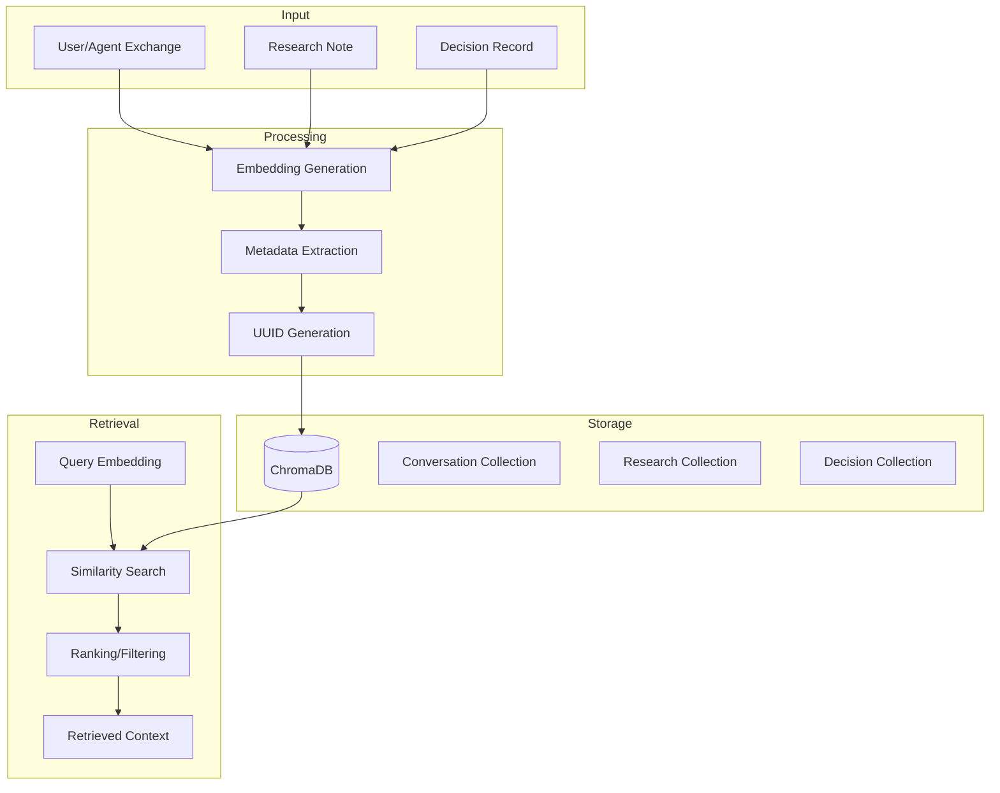

# Memory Architecture

Detailed documentation of the Narrative Memory System's technical implementation.

## Overview

The memory system provides semantic persistence for the agent's interactions, enabling contextual retrieval across sessions.



## Storage Layer

### ChromaDB Configuration

```python
import chromadb
from chromadb.config import Settings

# Initialize with persistence
client = chromadb.PersistentClient(
    path=str(config.memory_persist_path),
    settings=Settings(
        anonymized_telemetry=False,
    ),
)

# Get or create collection
collection = client.get_or_create_collection(
    name=config.memory_collection_name,
    metadata={"description": "ITSERR Agent narrative memory"},
)
```

### Document Schema

Each stored item has:

| Field | Type | Description |
|-------|------|-------------|
| `id` | string | UUID-based unique identifier |
| `embedding` | float[] | 384-dimensional embedding vector |
| `document` | string | Full text content |
| `metadata` | object | Stream type, timestamp, session, etc. |

### Metadata Structure

```python
metadata = {
    "stream_type": "conversation",  # conversation | research | decision
    "timestamp": "2026-02-15T14:30:00+00:00",
    "session_id": "luther-vocation-study",
    # Stream-specific fields
    "user_input_length": 150,  # conversation
    "response_length": 500,    # conversation
    "source": "Luther's Works",  # research
}
```

## Embedding Layer

### Provider Options

=== "OpenAI"

    ```python
    from langchain_openai import OpenAIEmbeddings

    embeddings = OpenAIEmbeddings(
        model="text-embedding-3-small",
        api_key=config.openai_api_key,
    )
    ```

=== "Local (Sentence Transformers)"

    ```python
    from sentence_transformers import SentenceTransformer

    embeddings = SentenceTransformer("all-MiniLM-L6-v2")
    ```

### Embedding Generation

```python
# For OpenAI embeddings
if hasattr(self._embeddings, "embed_query"):
    embedding = self._embeddings.embed_query(doc)
else:
    # For SentenceTransformer
    embedding = self._embeddings.encode(doc).tolist()
```

## Memory Streams

### MemoryItem Data Class

```python
@dataclass
class MemoryItem:
    content: str
    stream_type: StreamType
    timestamp: datetime = field(default_factory=_utc_now)
    session_id: str = "default"
    metadata: dict[str, Any] = field(default_factory=dict)

    @property
    def age_hours(self) -> float:
        """Calculate item age in hours."""
        delta = datetime.now(timezone.utc) - self.timestamp
        return delta.total_seconds() / 3600
```

### Stream Types

```python
class StreamType(str, Enum):
    CONVERSATION = "conversation"
    RESEARCH = "research"
    DECISION = "decision"
```

### Stream Classes

Each stream extends `BaseStream`:

```python
class BaseStream:
    stream_type: StreamType

    def add(self, content: str, session_id: str = "default", **metadata) -> MemoryItem:
        """Add item to stream."""

    def get_recent(self, count: int = 10, session_id: str | None = None) -> list[MemoryItem]:
        """Get recent items."""
```

## Storage Operations

### Storing Exchanges

```python
async def store_exchange(
    self,
    user_input: str,
    agent_response: str,
    session_id: str | None = None,
) -> None:
    timestamp = datetime.now(timezone.utc).isoformat()

    # Combine exchange into single document
    doc = f"User: {user_input}\n\nAssistant: {agent_response}"

    # Generate embedding
    embedding = self._embeddings.embed_query(doc)

    # Generate unique ID
    doc_id = f"conv_{uuid.uuid4().hex}"

    # Store in ChromaDB
    try:
        self._collection.add(
            ids=[doc_id],
            embeddings=[embedding],
            documents=[doc],
            metadatas=[{
                "stream_type": "conversation",
                "timestamp": timestamp,
                "session_id": session_id or "default",
            }],
        )
    except Exception as exc:
        logger.error("memory_store_failed", error=str(exc), exc_info=True)
        return
```

### Storing Research Notes

```python
async def store_research_note(
    self,
    content: str,
    source: str | None = None,
    session_id: str | None = None,
) -> None:
    doc_id = f"research_{uuid.uuid4().hex}"

    self._collection.add(
        ids=[doc_id],
        embeddings=[embedding],
        documents=[content],
        metadatas=[{
            "stream_type": "research",
            "timestamp": timestamp,
            "session_id": session_id or "default",
            "source": source or "unknown",
        }],
    )
```

### Storing Decisions

```python
async def store_decision(
    self,
    decision: str,
    alternatives: list[str] | None = None,
    rationale: str | None = None,
    session_id: str | None = None,
) -> None:
    doc = f"Decision: {decision}"
    if rationale:
        doc += f"\nRationale: {rationale}"
    if alternatives:
        doc += f"\nAlternatives considered: {', '.join(alternatives)}"

    doc_id = f"decision_{uuid.uuid4().hex}"

    self._collection.add(
        ids=[doc_id],
        embeddings=[embedding],
        documents=[doc],
        metadatas=[{
            "stream_type": "decision",
            "timestamp": timestamp,
            "session_id": session_id or "default",
        }],
    )
```

## Retrieval Operations

### Context Retrieval

```python
async def retrieve_context(
    self,
    query: str,
    session_id: str | None = None,
    top_k: int | None = None,
) -> str | None:
    k = top_k or self.config.memory_top_k

    # Generate query embedding
    query_embedding = self._embeddings.embed_query(query)

    # Build filter
    where_filter = {"session_id": session_id} if session_id else None

    # Query ChromaDB
    results = self._collection.query(
        query_embeddings=[query_embedding],
        n_results=k,
        where=where_filter,
        include=["documents", "metadatas", "distances"],
    )

    if not results["documents"] or not results["documents"][0]:
        return None

    # Format retrieved context
    return self._format_context(results)
```

### Context Formatting

```python
def _format_context(self, results: dict) -> str:
    context_parts = []

    for doc, meta, distance in zip(
        results["documents"][0],
        results["metadatas"][0],
        results["distances"][0],
    ):
        stream_type = meta.get("stream_type", "unknown")
        timestamp = meta.get("timestamp", "unknown")
        relevance = 1 - distance  # Convert distance to relevance

        context_parts.append(
            f"[{stream_type.upper()}] (relevance: {relevance:.2f}, from: {timestamp})\n{doc}"
        )

    return "\n\n---\n\n".join(context_parts)
```

## Timestamp Handling

### UTC Consistency

All timestamps are stored as UTC-aware:

```python
def _utc_now() -> datetime:
    """Return current UTC time as timezone-aware datetime."""
    return datetime.now(timezone.utc)
```

### Backwards Compatibility

When loading items with naive timestamps (from before UTC enforcement):

```python
@classmethod
def from_dict(cls, data: dict[str, Any]) -> "MemoryItem":
    timestamp = datetime.fromisoformat(data["timestamp"])
    if timestamp.tzinfo is None:
        timestamp = timestamp.replace(tzinfo=timezone.utc)
    return cls(..., timestamp=timestamp)
```

## Reflection System

### Trigger Mechanism

```python
# Track exchange count
self._exchange_count += 1

if self._exchange_count >= self.config.reflection_trigger_count:
    await self._trigger_reflection(session_id)
```

### Reflection Process (TODO)

```python
async def _trigger_reflection(self, session_id: str | None = None) -> None:
    """
    Trigger periodic reflection to summarize recent exchanges.

    TODO: Implement reflection summarization:
    1. Retrieve recent exchanges
    2. Generate summary using LLM
    3. Store summary as reflection document
    4. Archive/compress older detailed exchanges
    """
    logger.info("reflection_triggered", exchange_count=self._exchange_count)
    self._exchange_count = 0
```

## Configuration Reference

| Setting | Description | Default |
|---------|-------------|---------|
| `MEMORY_PERSIST_PATH` | ChromaDB storage directory | `./data/memory` |
| `MEMORY_COLLECTION_NAME` | Collection name | `itserr_memory` |
| `MEMORY_TOP_K` | Items to retrieve | `5` |
| `REFLECTION_TRIGGER_COUNT` | Exchanges before reflection | `10` |
| `EMBEDDING_PROVIDER` | `openai` or `local` | `openai` |
| `EMBEDDING_MODEL` | Model identifier | `text-embedding-3-small` |
