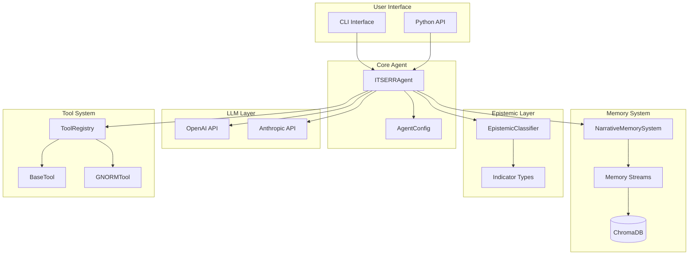
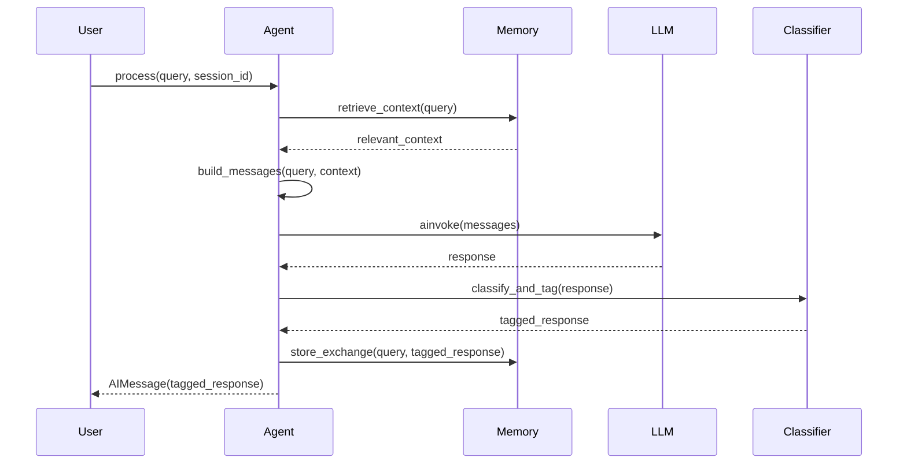

# System Design

This document provides a comprehensive overview of the ITSERR Agent architecture.

## High-Level Architecture



## Component Overview

### Core Components

| Component | Module | Purpose |
|-----------|--------|---------|
| `ITSERRAgent` | `core/agent.py` | Main orchestration class |
| `AgentConfig` | `core/config.py` | Configuration management |
| `NarrativeMemorySystem` | `memory/narrative.py` | Memory persistence and retrieval |
| `EpistemicClassifier` | `epistemic/classifier.py` | Response classification |
| `ToolRegistry` | `tools/registry.py` | Tool management and execution |

### Data Flow



## Module Structure

```
03_prototype/src/itserr_agent/
├── __init__.py           # Package entry point
├── cli.py                # Command-line interface
│
├── core/
│   ├── __init__.py
│   ├── agent.py          # ITSERRAgent class
│   └── config.py         # AgentConfig (Pydantic settings)
│
├── memory/
│   ├── __init__.py
│   ├── narrative.py      # NarrativeMemorySystem
│   └── streams.py        # Memory stream definitions
│
├── epistemic/
│   ├── __init__.py
│   ├── indicators.py     # IndicatorType, EpistemicIndicator
│   └── classifier.py     # EpistemicClassifier
│
├── tools/
│   ├── __init__.py
│   ├── base.py           # BaseTool abstract class
│   └── registry.py       # ToolRegistry
│
└── integrations/
    ├── __init__.py
    └── gnorm.py          # GNORM client and tool
```

## Key Design Decisions

### 1. Dual-Layer Epistemic Classification

**Decision:** Use both LLM-level instructions and post-processing classification.

**Rationale:** LLM instruction-following can be inconsistent. Post-processing ensures every response has proper epistemic tags.

```python
# System prompt instructs LLM to tag
system_prompt = """
1. EPISTEMIC MODESTY: Always classify your responses using these indicators:
   - [FACTUAL]: Verifiable information
   - [INTERPRETIVE]: AI-assisted analysis
   - [DEFERRED]: Matters requiring human judgment
"""

# Classifier validates/supplements
tagged = classifier.classify_and_tag(response.content)
```

### 2. ChromaDB for Persistence

**Decision:** Use ChromaDB with PersistentClient.

**Rationale:**
- Embedded database (no separate server)
- Semantic search built-in
- Simple Python API
- Persistence across sessions

### 3. Async-First Design

**Decision:** All I/O operations are async.

**Rationale:**
- LLM calls are I/O-bound
- Memory operations benefit from concurrency
- Better CLI responsiveness

```python
async def process(self, user_input: str, session_id: str | None = None) -> AIMessage:
    memory_context = await self._memory.retrieve_context(query=user_input)
    response = await self._llm.ainvoke(messages)
    await self._memory.store_exchange(user_input, tagged_response)
    return AIMessage(content=tagged_response)
```

### 4. Pydantic Settings for Configuration

**Decision:** Use pydantic-settings for configuration.

**Rationale:**
- Type validation
- Environment variable loading
- Sensible defaults
- IDE support

```python
class AgentConfig(BaseSettings):
    llm_provider: LLMProvider = LLMProvider.OPENAI
    llm_model: str = "gpt-4-turbo-preview"

    model_config = SettingsConfigDict(
        env_file=".env",
        env_file_encoding="utf-8",
    )
```

### 5. Tool Category System

**Decision:** Categorize tools by autonomy level.

**Rationale:** Different actions require different levels of user oversight. A memory lookup shouldn't require confirmation, but an external API call should.

## Error Handling

### Memory Operations

Memory errors are logged but don't halt execution:

```python
try:
    self._collection.add(ids=[doc_id], ...)
except Exception as exc:
    logger.error("memory_store_failed", error=str(exc), exc_info=True)
    return  # Continue without storing
```

### LLM Errors

LLM errors propagate to the caller:

```python
# No try/except - let caller handle
response = await self._llm.ainvoke(messages)
```

### Tool Errors

Tools return `ToolResult` with error information:

```python
return ToolResult(
    success=False,
    data=None,
    tool_name=self.name,
    error_message=str(exc)
)
```

## Extensibility Points

### Adding New LLM Providers

1. Add provider to `LLMProvider` enum
2. Update `_create_llm()` in agent.py
3. Add API key to config

### Adding New Memory Streams

1. Create new stream class in `streams.py`
2. Add to `NarrativeMemorySystem.__init__()`
3. Create storage method in `narrative.py`

### Adding New Tools

1. Inherit from `BaseTool`
2. Implement `name`, `description`, `category`, `execute()`
3. Register with `ToolRegistry`

## Performance Considerations

- **Embedding caching**: Consider caching embeddings for repeated queries
- **Memory pruning**: Implement reflection to prevent unbounded growth
- **Connection pooling**: HTTPX client reuse for external calls
- **Batch operations**: ChromaDB supports batch insertions
