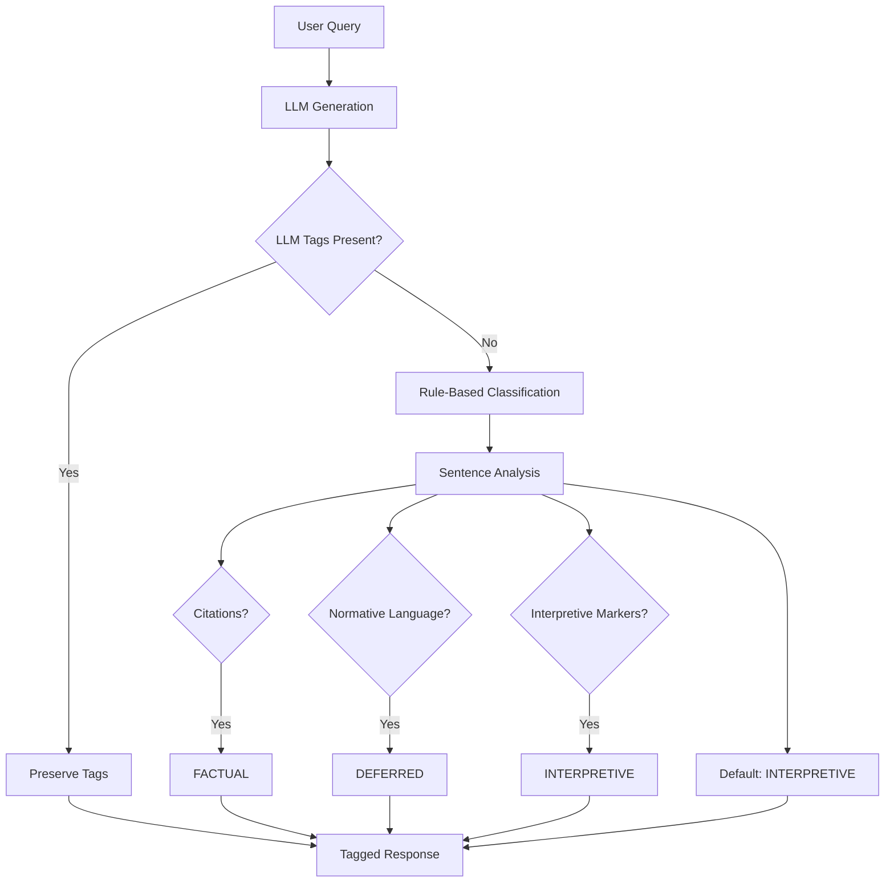

# Epistemic Indicators

Epistemic indicators are the cornerstone of the ITSERR Agent's approach to religious studies research. They provide clear differentiation between types of claims, preventing false certainty about interpretive matters.

## Why Epistemic Modesty?

Traditional AI assistants present all responses with equal confidence, regardless of the underlying epistemic status. This is problematic for religious studies where:

- Some claims are **verifiable facts** (dates, citations, historical events)
- Some claims are **interpretations** requiring scholarly judgment
- Some claims touch on **matters of faith** that AI cannot adjudicate

!!! danger "The Problem of False Certainty"

    An AI that states "This passage means X" with the same confidence as "This book was published in 1960" conflates radically different types of claims.

## The Three Indicators

### [FACTUAL]

Content that can be verified against authoritative sources.

**Characteristics:**

- Citations with page numbers
- Dates and historical events (with scholarly consensus)
- Definitions from specified sources
- Bibliographic data

**Examples:**

```
[FACTUAL] Hans-Georg Gadamer published "Truth and Method" in 1960.

[FACTUAL] According to the Nicene Creed (325 CE), Christ is described as
"begotten, not made, of one Being with the Father."

[FACTUAL] Barth's Church Dogmatics comprises 13 volumes totaling over
6 million words.
```

### [INTERPRETIVE]

AI-assisted analysis that requires researcher verification.

**Characteristics:**

- Connections between texts or concepts
- Thematic patterns across sources
- Structural analysis of arguments
- Comparative observations

**Examples:**

```
[INTERPRETIVE] This passage appears to echo Augustinian themes of
interiority and divine illumination.

[INTERPRETIVE] There seems to be a structural parallel between
Kierkegaard's "leap of faith" and Bonhoeffer's "costly grace."

[INTERPRETIVE] The frequency of covenant language in this section
suggests the author is working within a federal theology framework.
```

!!! note "Verification Required"

    Interpretive claims are not necessarily wrong—they may be insightful observations. But they require the researcher to verify and refine before incorporating into scholarly work.

### [DEFERRED]

Matters requiring human theological judgment that AI cannot determine.

**Characteristics:**

- Theological truth claims
- Value judgments about religious practices
- "Correct" interpretation of contested passages
- Assessments of spiritual significance

**Examples:**

```
[DEFERRED] Whether Rahner's "anonymous Christian" concept is theologically
adequate is a matter requiring normative theological judgment.

[DEFERRED] The spiritual efficacy of this liturgical practice cannot be
assessed by AI analysis.

[DEFERRED] Which interpretation of Romans 9 is "correct" involves
contested theological commitments that I cannot adjudicate.
```

## Classification Pipeline

The agent uses a dual-layer approach:



### Layer 1: LLM Instruction

The system prompt instructs the LLM to tag its responses:

```
You operate with three core principles:

1. EPISTEMIC MODESTY: Always classify your responses using these indicators:
   - [FACTUAL]: Verifiable information with citations
   - [INTERPRETIVE]: AI-assisted analysis requiring verification
   - [DEFERRED]: Matters requiring human judgment
```

### Layer 2: Rule-Based Validation

The `EpistemicClassifier` validates and supplements LLM tagging:

```python
from itserr_agent.epistemic.classifier import EpistemicClassifier

classifier = EpistemicClassifier(config)
tagged = classifier.classify_and_tag(response)
```

This "belt-and-suspenders" approach ensures consistent tagging even when LLM instruction-following varies.

## Confidence Scores

Each classification includes a confidence score (0.0 to 1.0):

| Confidence | Meaning |
|------------|---------|
| ≥ 0.85 | High confidence (e.g., clear citation) |
| 0.5 - 0.85 | Medium confidence |
| < 0.5 | Low confidence, flagged for review |

Low-confidence `[INTERPRETIVE]` items are flagged as needing human review.

## GNORM Integration

When using GNORM annotations, confidence maps to indicators:

- **≥ 85% confidence** → `[FACTUAL]`
- **< 85% confidence** → `[INTERPRETIVE]`

This threshold is configurable via `HIGH_CONFIDENCE_THRESHOLD`.

## Best Practices

### For Researchers

1. **Trust but verify** `[FACTUAL]` claims—check citations
2. **Engage critically** with `[INTERPRETIVE]` content
3. **Take responsibility** for `[DEFERRED]` matters

### For Developers

1. **Default to INTERPRETIVE** when uncertain
2. **Never auto-generate FACTUAL** without source verification
3. **Always include DEFERRED** for normative content

## Configuration

```python
# In config or .env
EPISTEMIC_DEFAULT=interpretive      # Default for ambiguous content
HIGH_CONFIDENCE_THRESHOLD=0.85      # Threshold for FACTUAL
LOW_CONFIDENCE_THRESHOLD=0.5        # Below this, flag for review
```
