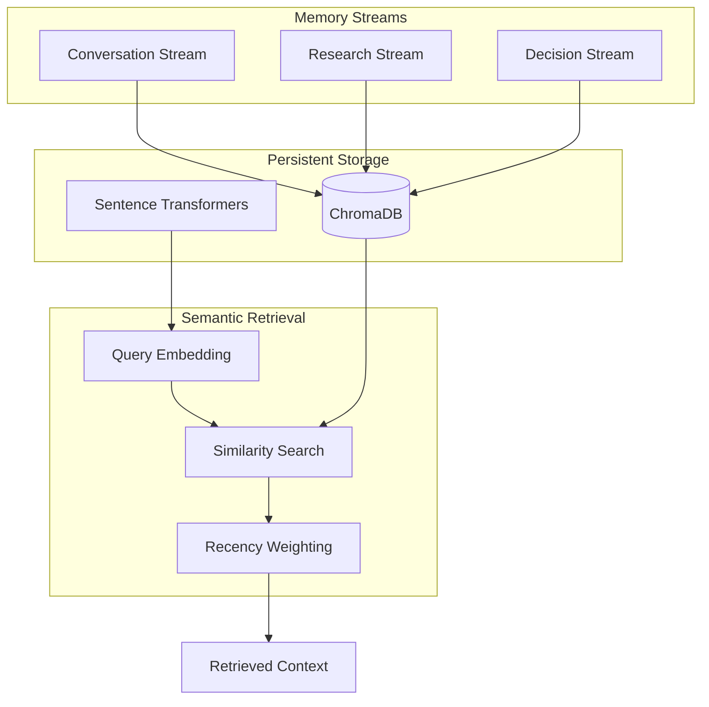
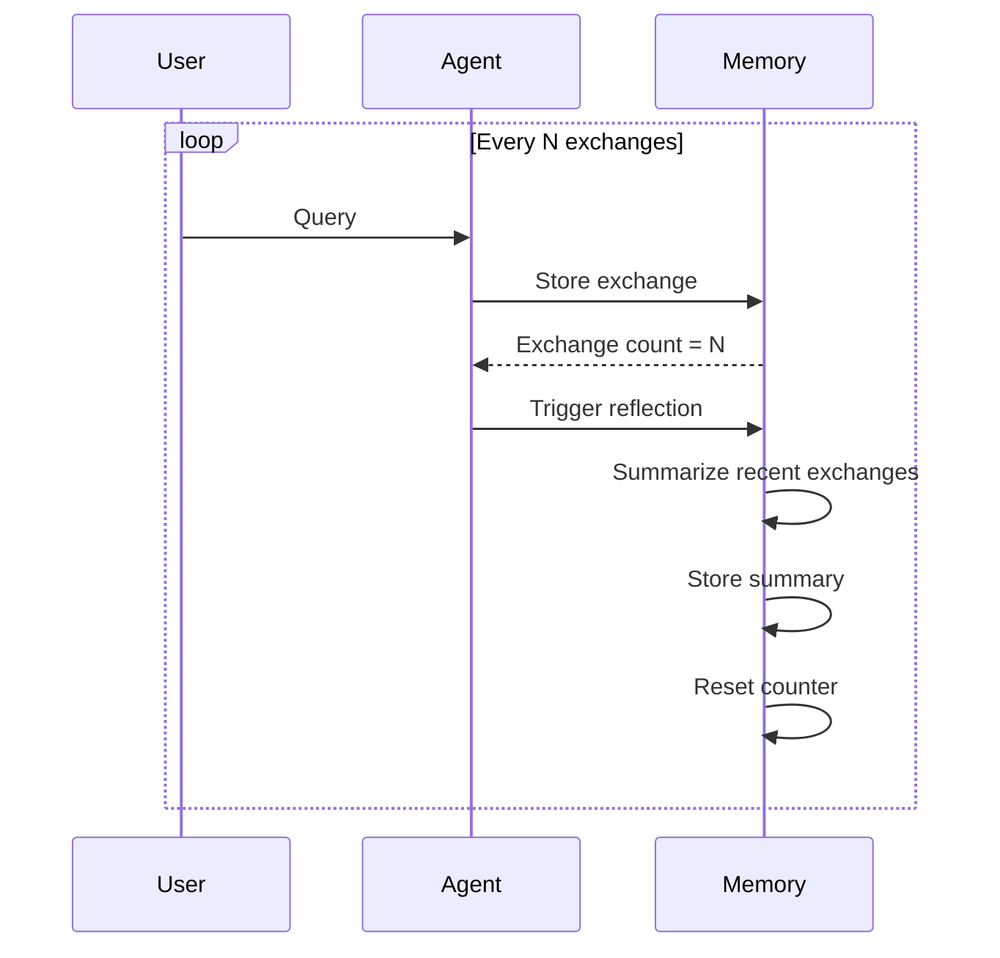

# Narrative Memory System

The Narrative Memory System maintains contextual continuity across research sessions, preserving the researcher's hermeneutical journey.

## Why Narrative Memory?

Traditional chatbots are stateless—each conversation starts fresh. This is inadequate for scholarly research where:

- Research projects span **days or weeks**
- Prior discussions inform **current interpretation**
- Methodological decisions should be **traceable**

!!! quote "Preserving the Hermeneutical Journey"

    The agent doesn't just remember data—it preserves the narrative of inquiry itself.

## Architecture



## The Three Streams

### Conversation Stream

Recent exchanges and clarifications.

**Characteristics:**

- High recency weight in retrieval
- Summarized after N exchanges (default: 10)
- Captures the flow of dialogue

**Use Cases:**

- "As we discussed earlier..."
- "Following up on your question about..."
- Maintaining coherent dialogue

```python
# Example stored item
{
    "content": "User: How does Gadamer relate to Heidegger?\n\nAssistant: [FACTUAL] Gadamer was Heidegger's student...",
    "stream_type": "conversation",
    "timestamp": "2026-02-15T14:30:00+00:00",
    "session_id": "hermeneutics-study"
}
```

### Research Stream

Sources consulted and notes created.

**Characteristics:**

- High relevance weight in retrieval
- Long-term retention (preserved across sessions)
- Captures scholarly engagement

**Use Cases:**

- Recording consulted sources
- Storing annotations and notes
- Building a research bibliography

```python
# Example stored item
{
    "content": "Source: Gadamer, Truth and Method (1960)\n\nNotes: Key concept of 'Wirkungsgeschichte' on pp. 267-274...",
    "stream_type": "research",
    "timestamp": "2026-02-14T10:15:00+00:00",
    "source": "gadamer-truth-method"
}
```

### Decision Stream

Methodological and interpretive choices.

**Characteristics:**

- Preserved indefinitely (important for research trajectory)
- Records reasoning and alternatives considered
- Enables reflection on research direction

**Use Cases:**

- "I chose to focus on X rather than Y because..."
- Tracking interpretive commitments
- Documenting methodological turns

```python
# Example stored item
{
    "content": "Decision: Focus on early Barth (Romans commentary period)\nRationale: More relevant to dialectical theology theme\nAlternatives considered: Later Church Dogmatics period",
    "stream_type": "decision",
    "timestamp": "2026-02-13T09:00:00+00:00"
}
```

## Retrieval Process

When processing a query, the agent retrieves relevant context:

```python
# 1. Generate query embedding
query_embedding = embeddings.encode("What did we discuss about Kierkegaard?")

# 2. Semantic search in ChromaDB
results = collection.query(
    query_embeddings=[query_embedding],
    n_results=5,
    where={"session_id": session_id}  # Optional session filter
)

# 3. Format context for LLM
context = format_retrieved_context(results)
```

### Retrieval Parameters

| Parameter | Description | Default |
|-----------|-------------|---------|
| `top_k` | Number of items to retrieve | 5 |
| `session_id` | Filter to specific session | None (all sessions) |

## Persistence

Memory is persisted via ChromaDB:

```python
# Storage location (configurable)
MEMORY_PERSIST_PATH=./data/memory

# Collection name
MEMORY_COLLECTION_NAME=itserr_memory
```

Data persists across agent restarts, enabling long-running research projects.

## Reflection Mechanism

After N exchanges (configurable), the system triggers reflection:



This prevents context window overflow while preserving the essential narrative.

!!! note "Implementation Status"

    Reflection summarization is marked as TODO for full implementation. Currently, the trigger count is tracked but summarization logic is pending.

## Usage Examples

### Starting a Session

```python
agent = ITSERRAgent(config)

# First query - no prior context
response = await agent.process(
    "I'm researching Luther's concept of vocation",
    session_id="luther-vocation-study"
)
```

### Continuing a Session

```python
# Later query - retrieves prior context
response = await agent.process(
    "How does this relate to what we discussed about calling?",
    session_id="luther-vocation-study"
)
# Agent retrieves relevant prior exchanges about vocation/calling
```

### Storing Research Notes

```python
await agent._memory.store_research_note(
    content="Key passage on vocation in LW 45:39-40",
    source="Luther's Works Vol. 45",
    session_id="luther-vocation-study"
)
```

### Recording Decisions

```python
await agent._memory.store_decision(
    decision="Focus on Luther's early lectures rather than later disputations",
    rationale="Earlier works show development of vocation concept",
    alternatives=["Later systematic treatments", "Polemical writings"],
    session_id="luther-vocation-study"
)
```

## Configuration

```bash
# Memory settings in .env
MEMORY_PERSIST_PATH=./data/memory
MEMORY_COLLECTION_NAME=itserr_memory
MEMORY_TOP_K=5
REFLECTION_TRIGGER_COUNT=10

# Embedding settings
EMBEDDING_PROVIDER=local
EMBEDDING_MODEL=all-MiniLM-L6-v2
```

## Best Practices

1. **Use meaningful session IDs** - `luther-vocation-study` not `session1`
2. **Store important notes explicitly** - Don't rely solely on conversation storage
3. **Record key decisions** - Especially methodological choices
4. **Review retrieved context** - The agent shows what it remembers
