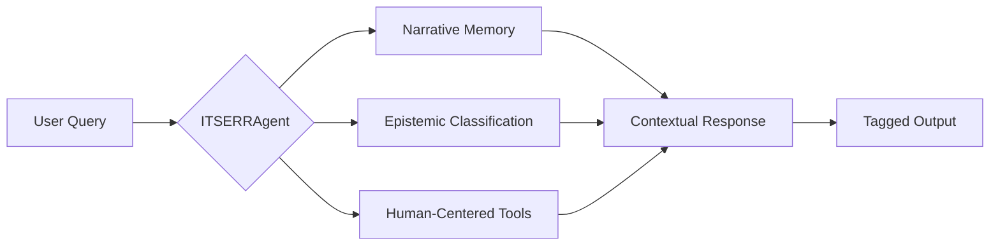

# Core Concepts Overview

The ITSERR AI Agent is built on three foundational innovations that distinguish it from general-purpose AI assistants.

## The Problem

When AI systems engage with religious and theological content, they face unique challenges:

1. **Epistemological Complexity** - Not all claims have the same epistemic status
2. **Hermeneutical Depth** - Interpretation is context-dependent and tradition-bound
3. **Normative Sensitivity** - Some matters require human judgment, not algorithmic determination

## Our Solution: Three Core Innovations

### 1. Epistemic Modesty Indicators

Every response is tagged with indicators that clarify the nature of the claim:

- **`[FACTUAL]`** - Verifiable information with sources
- **`[INTERPRETIVE]`** - AI-assisted analysis requiring verification
- **`[DEFERRED]`** - Matters requiring human theological judgment

This prevents the agent from presenting interpretive conclusions as established facts or attempting to adjudicate theological disputes.

[:octicons-arrow-right-24: Learn more about Epistemic Indicators](epistemic-indicators.md)

### 2. Narrative Memory System

Unlike stateless chatbots, the agent maintains:

- **Conversation Stream** - Recent dialogue for coherence
- **Research Stream** - Sources and notes for scholarly continuity
- **Decision Stream** - Methodological choices for transparency

This enables the agent to support extended research projects across multiple sessions.

[:octicons-arrow-right-24: Learn more about Narrative Memory](narrative-memory.md)

### 3. Human-Centered Tool Patterns

Tools are categorized by their level of autonomy:

| Category | Behavior | Example |
|----------|----------|---------|
| Internal | Autonomous | Memory retrieval |
| Query | Logged | Database searches |
| External | Confirmation required | API calls |
| Modification | Explicit approval | File changes |

This ensures the researcher maintains control over consequential actions.

[:octicons-arrow-right-24: Learn more about Tool Patterns](tool-patterns.md)

## Philosophical Foundation

These innovations emerge from a personalist anthropology that views the human researcher as:

1. **Irreducibly personal** - Not replaceable by algorithmic processes
2. **Historically situated** - Embedded in interpretive traditions
3. **Normatively responsible** - Accountable for theological judgments

The agent is designed to **assist** scholarly inquiry, not **replace** the scholar.

## Integration with ITSERR/RESILIENCE

The agent integrates with the broader ITSERR infrastructure:

| Component | Integration |
|-----------|-------------|
| **WP3 (GNORM)** | CRF-based named entity recognition |
| **WP4 (DaMSym)** | Semantic textual analysis patterns |
| **WP6 (YASMINE)** | Ethical guidelines for religious AI |
| **WP7 (REVER)** | Hermeneutical tradition awareness |

## Design Principles

1. **Transparency** - The agent explains its reasoning and uncertainty
2. **Deference** - The agent knows when to defer to human judgment
3. **Continuity** - The agent maintains narrative coherence across sessions
4. **Respect** - The agent treats religious content with appropriate sensitivity
