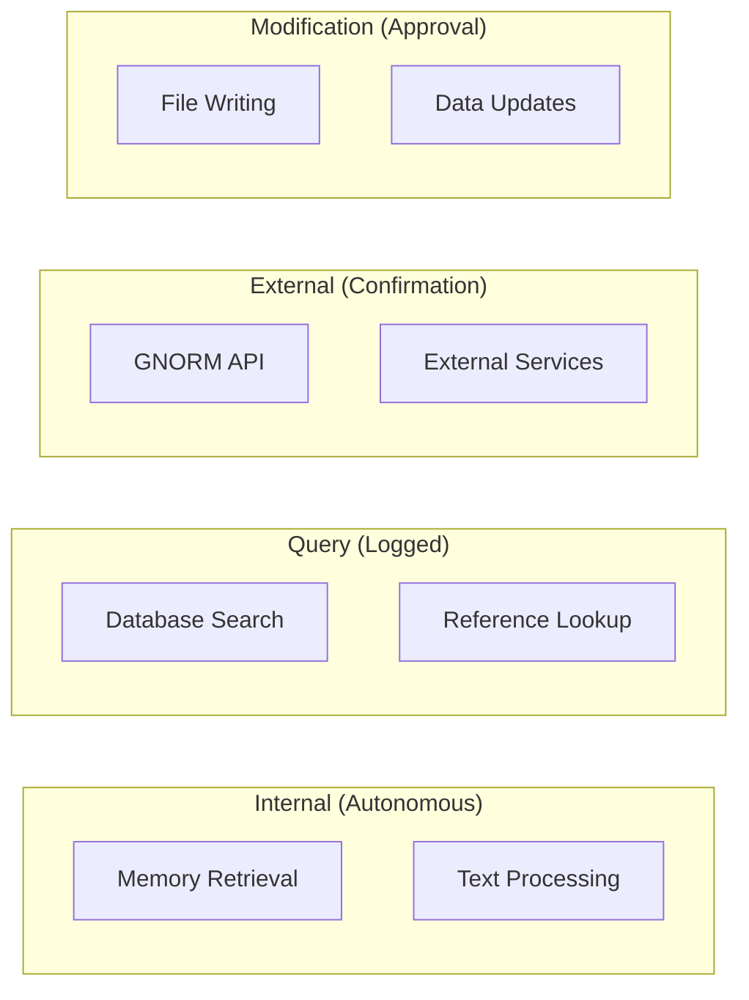
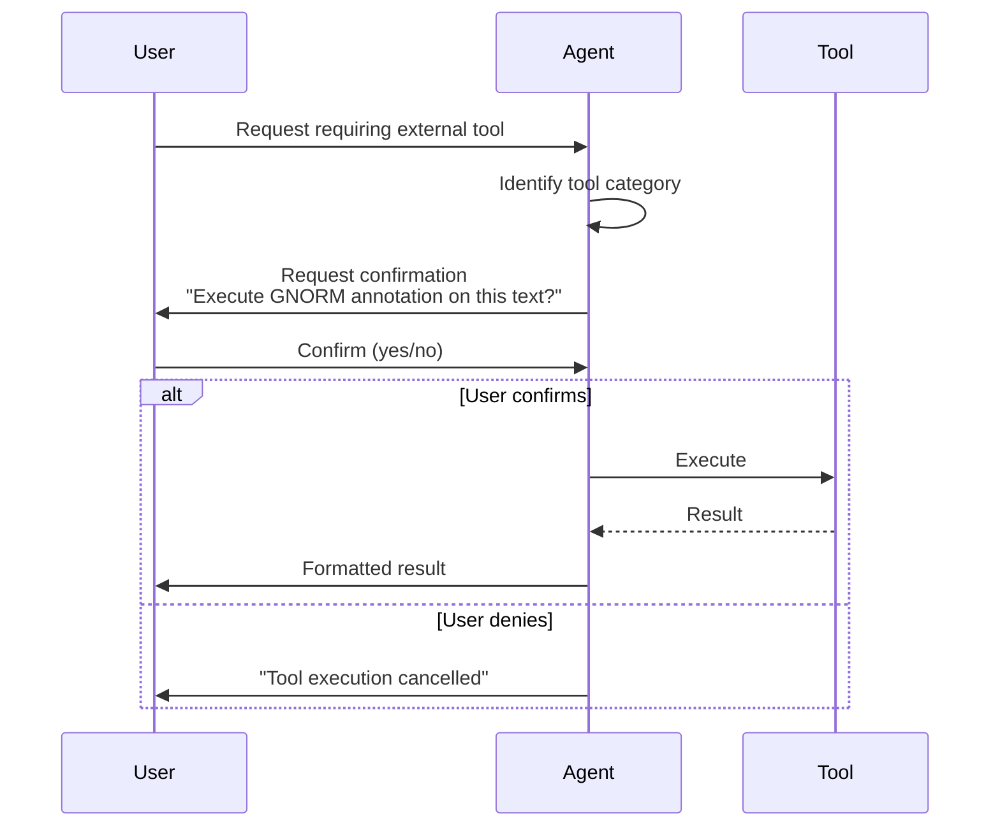

# Human-Centered Tool Patterns

The tool system ensures researchers maintain agency and control throughout AI-assisted inquiry.

## Design Philosophy

AI tools can perform actions with varying levels of consequence:

- **Low consequence**: Retrieving information from memory
- **Medium consequence**: Querying external databases
- **High consequence**: Modifying files or calling external APIs

The tool pattern system ensures appropriate human oversight for each level.

## Tool Categories



### Internal Tools

**Behavior:** Autonomous execution, no user interaction required.

**Rationale:** These operations have no external effects and support the agent's core function.

**Examples:**

- Memory context retrieval
- Text embedding generation
- Internal state management

```python
class ToolCategory(str, Enum):
    INTERNAL = "internal"  # Autonomous
```

### Query Tools

**Behavior:** Transparent execution with logging.

**Rationale:** Read-only operations that the user should be aware of but don't require approval.

**Examples:**

- Searching the memory store
- Looking up bibliographic references
- Querying local databases

```python
class ToolCategory(str, Enum):
    QUERY = "query"  # Logged, transparent
```

### External Tools

**Behavior:** Requires user confirmation before execution.

**Rationale:** Interactions with external systems should be explicitly authorized.

**Examples:**

- GNORM API annotation requests
- External database queries
- Web service calls

```python
class ToolCategory(str, Enum):
    EXTERNAL = "external"  # Confirmation required
```

### Modification Tools

**Behavior:** Requires explicit user approval with preview.

**Rationale:** Actions that change state must be fully authorized by the researcher.

**Examples:**

- Writing research notes to files
- Updating bibliographic databases
- Exporting annotations

```python
class ToolCategory(str, Enum):
    MODIFICATION = "modification"  # Explicit approval
```

## Tool Architecture

### BaseTool Abstract Class

All tools inherit from `BaseTool`:

```python
from abc import ABC, abstractmethod
from dataclasses import dataclass
from typing import Any

@dataclass
class ToolResult:
    success: bool
    data: Any | None
    tool_name: str
    category: ToolCategory
    error_message: str | None = None
    execution_time_ms: float = 0.0

class BaseTool(ABC):
    @property
    @abstractmethod
    def name(self) -> str:
        """Unique tool identifier."""
        pass

    @property
    @abstractmethod
    def description(self) -> str:
        """Human-readable description."""
        pass

    @property
    @abstractmethod
    def category(self) -> ToolCategory:
        """Tool category determining execution behavior."""
        pass

    @abstractmethod
    async def execute(self, **kwargs: Any) -> ToolResult:
        """Execute the tool with given parameters."""
        pass
```

### Tool Registry

Tools are registered and managed centrally:

```python
from itserr_agent.tools.registry import ToolRegistry

registry = ToolRegistry()
registry.register(gnorm_tool)
registry.register(memory_tool)

# Execute with timing
result = await registry.execute("gnorm_annotate", text="...")
```

## GNORM Tool Example

The GNORM integration demonstrates the external tool pattern:

```python
class GNORMTool(BaseTool):
    @property
    def name(self) -> str:
        return "gnorm_annotate"

    @property
    def description(self) -> str:
        return "Annotate text with GNORM CRF-based named entity recognition"

    @property
    def category(self) -> ToolCategory:
        return ToolCategory.EXTERNAL  # Requires confirmation

    async def execute(self, **kwargs: Any) -> ToolResult:
        text = kwargs.get("text", "")

        if not text:
            return ToolResult(
                success=False,
                data=None,
                tool_name=self.name,
                category=self.category,
                error_message="No text provided"
            )

        response = await self._gnorm_client.annotate(text=text)

        return ToolResult(
            success=True,
            data={"annotations": [...], "count": len(response.annotations)},
            tool_name=self.name,
            category=self.category,
            execution_time_ms=response.processing_time_ms
        )
```

## Confirmation Flow

For external and modification tools:



## Result Formatting

Each tool provides a human-readable format:

```python
class GNORMTool(BaseTool):
    def format_result(self, result: ToolResult) -> str:
        if not result.success:
            return f"GNORM annotation failed: {result.error_message}"

        count = result.data.get("count", 0)
        if count == 0:
            return "No entities found in the text."

        lines = [f"Found {count} entities:"]
        for ann in result.data.get("annotations", []):
            indicator = ann.get("indicator", "INTERPRETIVE")
            lines.append(
                f"  [{indicator}] {ann['text']} ({ann['type']}, "
                f"confidence: {ann['confidence']:.0%})"
            )

        return "\n".join(lines)
```

## Best Practices

### For Tool Developers

1. **Choose the right category** - When in doubt, use a more restrictive category
2. **Provide clear descriptions** - Users need to understand what the tool does
3. **Handle errors gracefully** - Return `ToolResult` with error details
4. **Log execution** - Use structured logging for debugging

### For Agent Developers

1. **Respect categories** - Don't bypass confirmation for external tools
2. **Show transparency** - Display tool calls and results to users
3. **Allow cancellation** - Users should always be able to abort

### For Researchers

1. **Review confirmations** - Understand what tools are doing
2. **Check results** - Especially for external tool outputs
3. **Report issues** - Unexpected tool behavior should be flagged

## Configuration

```python
# Tool timeout settings
TOOL_TIMEOUT_MS = 30000  # 30 seconds default

# GNORM-specific
GNORM_TIMEOUT = 30.0
```
