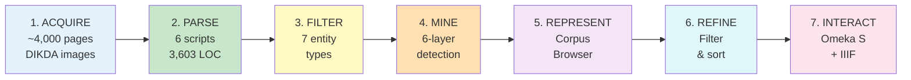
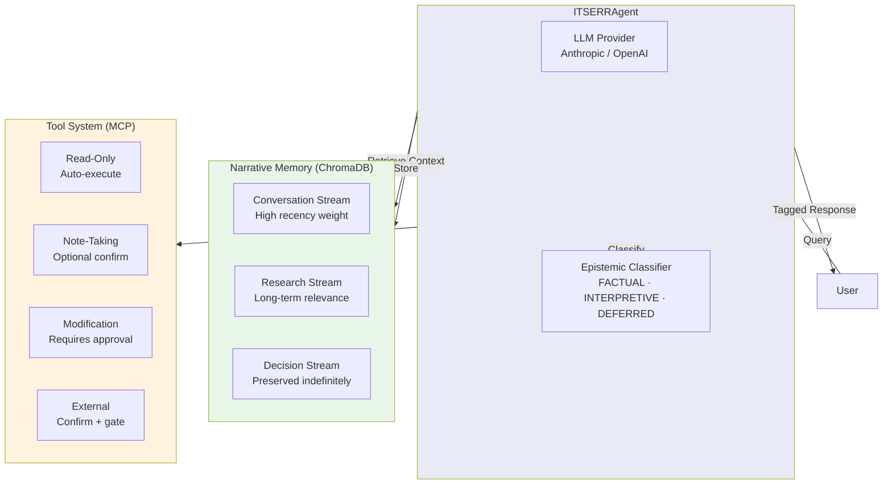

# ITSERR / RESILIENCE Project

**Ethically-Grounded AI Agents for Religious Studies Research**

*From Personalist Anthropology to Technical Implementation*

---

<div class="grid cards" markdown>

-   :material-brain:{ .lg .middle } __Epistemic Modesty__

    ---

    Tripartite classification -- `FACTUAL`, `INTERPRETIVE`, `DEFERRED` -- at every layer of the pipeline, from CRF confidence scores to the interactive Corpus Browser

    [:octicons-arrow-right-24: Framework](concepts/epistemic-indicators.md)

-   :material-text-recognition:{ .lg .middle } __OCR Pipeline__

    ---

    Six production scripts (3,603 LOC) processing 16th-century Latin texts through OCR, normalization, and annotation with 414 passing tests

    [:octicons-arrow-right-24: Pipeline docs](pipeline/overview.md)

-   :material-book-search:{ .lg .middle } __Corpus Browser__

    ---

    Interactive three-column prototype with dashboard -- 31 detected references across 5 entity types with detection provenance

    [:octicons-arrow-right-24: Try it](corpus-browser.md)

-   :material-connection:{ .lg .middle } __GNORM Adaptation__

    ---

    Adapting the CIC_annotation pipeline from medieval Canon law to 16th-century Protestant theological texts

    [:octicons-arrow-right-24: Integration](architecture/gnorm-integration.md)

-   :material-memory:{ .lg .middle } __Narrative Memory__

    ---

    Three-stream ChromaDB memory (conversation, research, decision) preserving the hermeneutical journey across sessions

    [:octicons-arrow-right-24: Architecture](concepts/narrative-memory.md)

-   :material-tools:{ .lg .middle } __Human-Centered Tools__

    ---

    Tool-calling patterns categorized by autonomy level -- the more consequential the action, the more control the researcher retains

    [:octicons-arrow-right-24: Patterns](concepts/tool-patterns.md)

</div>

---

## What This Project Does

This project bridges **twenty years of theological hermeneutics** with **AI agent development** to create tools for religious studies that respect hermeneutical complexity. Conducted in collaboration with the University of Palermo's Software Lab and the GNORM project team, it delivers three interlocking contributions:

!!! info "Fellowship Context"

    **ITSERR Transnational Access (TNA) Fellowship** | University of Palermo (UniPa)

    **Fellow:** Prof. Michal Valco (Comenius University Bratislava, ELTF)

    **Hosts:** Dr. Arianna Maria Pavone & Marcello Costa (UniPa Software Lab)

    **Period:** February 10--27, 2026

### The Core Challenge

We are adapting the **GNORM/CIC_annotation pipeline** -- originally built for detecting legal citations in medieval Canon law -- to **detect theological citations** (biblical, patristic, confessional) in 16th--18th century religious texts from the Kingdom of Hungary as a long-term goal, with the current pilot focusing on a 16th-century text by Leonard Stöckel.

The philosophical question: *How should AI handle texts where some claims are verifiable, others require interpretation, and still others touch matters of faith that no algorithm can adjudicate?*

---

## The Pipeline: Seven Stages

The core technical contribution follows Marcello Costa's data processing framework (Fry 2007), adapted for theological text analysis.



[:octicons-arrow-right-24: Full 7-stage specification](https://github.com/michalvalco/ITSERR-RESILIENCE-Project/blob/main/01_research/workflow_diagram.md)

### Stage 2: The OCR Pipeline (Built and Tested)

Six production scripts process digitized pages into pipeline-ready annotated sequences:

| Script | LOC | Tests | Purpose |
|--------|----:|------:|---------|
| `ocr_processor.py` | 427 | 34 | Tesseract OCR with Latin support :octicons-arrow-right-16: plaintext + ALTO XML |
| `extract_alto.py` | 681 | 55 | ALTO XML parser :octicons-arrow-right-16: plaintext + per-word confidence CSV |
| `normalize_text.py` | 839 | 121 | Orthographic normalization + abbreviation expansion with provenance |
| `cas_to_bioes.py` | 593 | 48 | INCEpTION CAS XMI :octicons-arrow-right-16: BIOES-tagged sequences |
| `zero_shot_crf_experiment.py` | 590 | 56 | Cross-domain CRF transfer experiment |
| `build_corpus_json.py` | 473 | 21 | Corpus Browser data generator with detection provenance |
| **Total** | **3,603** | **335** | *+ 79 agent tests = 414 total* |

[:octicons-arrow-right-24: Pipeline documentation](pipeline/overview.md)

### Stage 4: Six-Layer Detection

```
Layer 1: Rule-based regex      (84 patterns for biblical, patristic, confessional refs)
Layer 2: Abbreviation dictionary (consumes expansion_log from Stage 2)
Layer 3: Trie matching          + statistical gap prediction
Layer 4: CRF machine learning   (trained on INCEpTION annotations)
Layer 5: Structural parsing     (section headers, chapter markers)
Merge:   Priority L1 > L2 > L3 > L4 > L5, with post-processing
```

!!! success "Epistemic Logic"

    When **multiple layers agree** on a detection :octicons-arrow-right-16: **FACTUAL**. When they **disagree** :octicons-arrow-right-16: **DEFERRED** for human review.

---

## Epistemic Modesty Framework

The core philosophical innovation: AI must be transparent about the *kind* of knowledge it is producing.

=== "Classification Thresholds"

    | Indicator | When Applied | Confidence |
    |-----------|-------------|-----------|
    | **`[FACTUAL]`** | :octicons-check-16: 2+ methods agree, or single method with high confidence | Biblical >= 0.85, Confessional >= 0.80 |
    | **`[INTERPRETIVE]`** | :octicons-dash-16: Single method, moderate confidence | 0.70 -- 0.85 |
    | **`[DEFERRED]`** | :octicons-x-16: Methods disagree, low confidence, or requires theological judgment | < 0.70 |

=== "Five Registers of Religious Text"

    | Register | Example | AI Competence |
    |----------|---------|--------------|
    | **Historical-factual** | "Luther posted 95 Theses in 1517" | High -- verification, citation |
    | **Textual-linguistic** | "*hesed* appears 248 times in OT" | High -- counting, pattern ID |
    | **Interpretive-synthetic** | "Echoes Wisdom literature themes" | Medium -- suggest, flag |
    | **Theological-normative** | "Text teaches God is love" | Low -- defer to human |
    | **Existential-transformative** | "What does this mean for my faith?" | None -- beyond AI competence |

=== "In Practice"

    ```
    [FACTUAL] Stöckel cites Augustine's De Civitate Dei XIV.28 on page 12.
              (Two methods agree: regex match + abbreviation dictionary)

    [INTERPRETIVE] This passage appears to echo Melanchthon's locus on
                   justification, suggesting intellectual dependence.
                   (Single method, confidence 0.78)

    [DEFERRED] Whether Stöckel's reading of Romans 3:28 constitutes a
               departure from the Augsburg Confession requires expert
               theological judgment.
    ```

[:octicons-arrow-right-24: Full framework](research/epistemic-modesty.md)

---

## Stöckel Corpus Pilot Study

The pipeline is being tested on Leonard Stöckel's *Annotationes in Locos communes* (1561) -- a 16th-century Latin theological commentary with dense citation networks.

<div class="grid cards" markdown>

-   :material-file-document-multiple:{ .lg .middle } __Corpus Data__

    ---

    **12** normalized files from **57** pages

    **~18,900** words processed

    **1,913** OCR noise characters removed

-   :material-book-open-variant:{ .lg .middle } __References Found__

    ---

    **31** references across **5** types

    13 biblical | 11 classical | 4 patristic

    2 confessional | 1 reformation

-   :material-format-text:{ .lg .middle } __Text Processing__

    ---

    **156** abbreviations expanded (17 patterns)

    **658** long-s corrections

    **84** reference detection patterns

-   :material-test-tube:{ .lg .middle } __Quality__

    ---

    **414** tests passing across **11** suites

    **18/23** tasks complete (78%)

    **6** production scripts (3,603 LOC)

</div>

[:octicons-arrow-right-24: Pilot study details](pipeline/stockel-pilot.md) | [:octicons-arrow-right-24: Progress tracker](https://github.com/michalvalco/ITSERR-RESILIENCE-Project/blob/main/03_prototype/stockel_annotation/PROGRESS.md)

---

## AI Agent Architecture

The `itserr-agent` package implements three core innovations on top of LangChain/LangGraph:



[:octicons-arrow-right-24: System design](architecture/system-design.md) | [:octicons-arrow-right-24: Memory architecture](architecture/memory-architecture.md)

---

## Quick Start

=== "AI Agent"

    ```bash
    cd 03_prototype
    pip install -e ".[dev]"

    # Full agent mode (requires API key)
    export ITSERR_ANTHROPIC_API_KEY="your-key"
    itserr-agent chat

    # Guided demo (no API key required)
    itserr-agent demo
    ```

=== "OCR Pipeline"

    ```bash
    cd 03_prototype

    # OCR a PDF with Latin language support
    python stockel_annotation/scripts/ocr_processor.py input.pdf --format both --lang lat

    # Parse ALTO XML to plaintext + confidence scores
    python stockel_annotation/scripts/extract_alto.py data/alto/ --confidence

    # Normalize and expand abbreviations
    python stockel_annotation/scripts/normalize_text.py data/cleaned/ --output data/normalized/

    # Generate Corpus Browser data
    python stockel_annotation/scripts/build_corpus_json.py
    ```

=== "Run Tests"

    ```bash
    cd 03_prototype
    pip install -e ".[dev]"
    python -m pytest tests/ -v
    # 414 tests passing across 11 suites
    ```

=== "Documentation Site"

    ```bash
    # From the repository root
    pip install -e "03_prototype/.[dev]"
    mkdocs serve
    # Open http://127.0.0.1:8000
    ```

[:octicons-arrow-right-24: Full installation guide](getting-started/installation.md) | [:octicons-arrow-right-24: Configuration](getting-started/configuration.md)

---

## Technical Stack

| Layer | Technology | Purpose |
|-------|-----------|---------|
| **Agent** | LangChain / LangGraph | Agent orchestration with human-in-the-loop |
| **Memory** | ChromaDB + Sentence Transformers | Semantic narrative memory (3 streams) |
| **Tools** | Model Context Protocol (MCP) | Transparent, confirmable tool integration |
| **OCR** | Tesseract + ALTO XML | Latin text extraction with confidence scoring |
| **NLP** | CRFsuite + sklearn-crfsuite | Sequence labeling for entity detection |
| **Annotation** | INCEpTION + dkpro-cassis | Manual annotation + CAS XMI processing |
| **Visualization** | Interactive HTML/JS | Corpus Browser with dashboard |
| **Documentation** | MkDocs Material | 37-page documentation site |
| **Platform** | Python 3.11+ | Hatchling build, pytest, ruff, mypy |

---

## Key Deliverables

| # | Deliverable | Status |
|---|------------|--------|
| 1 | **Working Paper** -- "Personalist Foundations for AI-Assisted Theological Research" (~16-17K words, 9 sections) | :material-check-circle:{ .green } Integration pass complete |
| 2 | **7-Stage Workflow Diagram** -- GNORM adaptation for Stöckel corpus | :material-check-circle:{ .green } Complete, reviewed against code |
| 3 | **OCR Pipeline** -- 6 scripts, 3,603 LOC, 414 tests | :material-check-circle:{ .green } Production-ready |
| 4 | **Corpus Browser** -- Interactive prototype with dashboard | :material-check-circle:{ .green } Layer 1 complete |
| 5 | **Epistemic Modesty Framework** | :material-check-circle:{ .green } Complete |
| 6 | **AI Agent Prototype** -- Narrative memory + epistemic classification + tool patterns | :material-check-circle:{ .green } Functional |
| 7 | **Documentation Site** -- 37 MkDocs pages | :material-check-circle:{ .green } Deployed |
| 8 | **Consortium Presentation** | :material-progress-clock:{ .amber } Scheduled Feb 25 |
| 9 | **Blog Post** -- For ITSERR/RESILIENCE website | :material-progress-clock:{ .amber } Due March 2026 |

---

## Levels of AI Engagement

A typology of how AI can engage with religious/theological texts, with increasing interpretive depth:

| Level | Name | AI Role | Epistemic Status |
|-------|------|---------|-----------------|
| 1 | **Information Retrieval** | Finding, counting, verifying | Primarily `FACTUAL` |
| 2 | **Structured Synthesis** | Organizing, pattern identification | `FACTUAL` + `INTERPRETIVE` |
| 3 | **Interpretive Assistance** | Suggesting connections, flagging tensions | Primarily `INTERPRETIVE` |
| 4 | **Collaborative Reasoning** | Dialogue-based exploration | `INTERPRETIVE` + `DEFERRED` |

!!! note ""

    The pipeline operates at Levels 1--2. The AI agent extends into Level 3. Level 4 always requires a human researcher in the loop.

---

## Context: ITSERR & RESILIENCE

**ITSERR** (Italian Strengthening of the ESFRI RI RESILIENCE) supports the **RESILIENCE** research infrastructure -- *Religious Studies Infrastructure: tooLs, Innovation, Experts, coNnections and Centres in Europe*.

| WP | Name | Connection |
|----|------|-----------|
| **WP3** | **T-ReS** | Direct collaboration -- GNORM team provides the base pipeline and CRF methodology |
| WP4 | DaMSym | Semantic textual analysis insights for entity classification |
| WP6 | YASMINE | Ethical guidelines for AI handling of religious content |
| WP7 | REVER | Hermeneutical traditions informing ML application design |
| WP8 | UbiQuity | Citation network analysis and cross-reference challenges |

---

## Repository Guide

| Directory | Contents |
|-----------|----------|
| `01_research/` | Research foundations: [workflow diagram](https://github.com/michalvalco/ITSERR-RESILIENCE-Project/blob/main/01_research/workflow_diagram.md), [epistemic framework](https://github.com/michalvalco/ITSERR-RESILIENCE-Project/blob/main/01_research/epistemic_modesty_framework.md), literature notes |
| `02_writing/` | [Working paper](https://github.com/michalvalco/ITSERR-RESILIENCE-Project/tree/main/02_writing/working_paper) (~16-17K words), blog post draft |
| `03_prototype/` | AI agent + OCR pipeline (414 tests) -- `cd 03_prototype && pip install -e ".[dev]"` |
| `04_presentations/` | Consortium presentation materials (Feb 25/27) |
| `05_admin/` | Administrative documents, correspondence, milestones |
| `docs/` | This MkDocs site -- `mkdocs serve` to preview locally |

---

## Acknowledgments

This research is supported by the **ITSERR Transnational Access Fellowship** program, hosted by the **University of Palermo**. Special thanks to:

- **Dr. Arianna Maria Pavone** and the GNORM project team (WP3)
- **Marcello Costa** for the pipeline framework and methodology guidance
- **Prof. Andrea Ferrara** and the UniPa Software Lab
- The **RESILIENCE** research infrastructure consortium

---

*Last updated: February 14, 2026*

*Part of the [RESILIENCE Research Infrastructure](https://www.resilience-ri.eu/) -- Code: MIT License | Documentation: CC BY 4.0*
