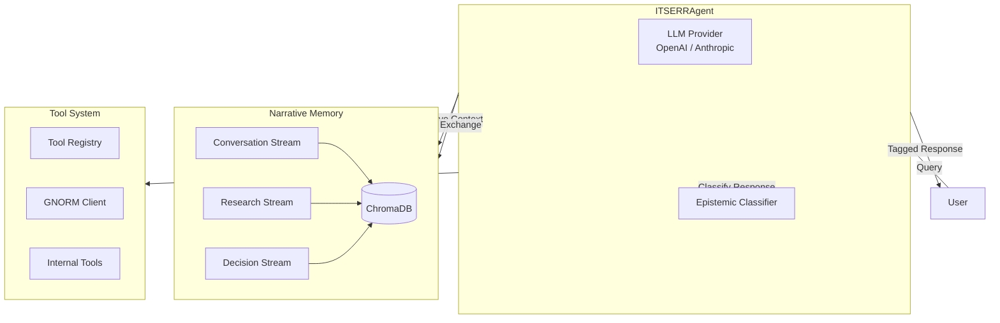

# ITSERR/RESILIENCE AI Agent

**Ethically-Grounded AI Agents for Religious Studies Research**

---

<div class="grid cards" markdown>

-   :material-brain:{ .lg .middle } __Epistemic Modesty__

    ---

    Clear differentiation between factual, interpretive, and deferred-to-human responses

    [:octicons-arrow-right-24: Learn more](concepts/epistemic-indicators.md)

-   :material-memory:{ .lg .middle } __Narrative Memory__

    ---

    Contextual continuity across research sessions, preserving the hermeneutical journey

    [:octicons-arrow-right-24: Learn more](concepts/narrative-memory.md)

-   :material-tools:{ .lg .middle } __Human-Centered Tools__

    ---

    Transparent tool calling with appropriate confirmation levels

    [:octicons-arrow-right-24: Learn more](concepts/tool-patterns.md)

-   :material-connection:{ .lg .middle } __GNORM Integration__

    ---

    CRF-based named entity recognition for religious texts (WP3)

    [:octicons-arrow-right-24: Learn more](architecture/gnorm-integration.md)

-   :material-text-recognition:{ .lg .middle } __OCR Pipeline__

    ---

    Two-stage OCR pipeline for 16th-century Latin texts with ALTO XML and confidence scoring

    [:octicons-arrow-right-24: Learn more](pipeline/overview.md)

-   :material-book-search:{ .lg .middle } __Corpus Browser__

    ---

    Interactive prototype for browsing Stöckel's *Annotationes* with 31 detected references across 5 entity types

    [:octicons-arrow-right-24: Try it](corpus-browser.md)

</div>

## Project Overview

This project bridges twenty years of theological hermeneutics with AI agent development, aiming to create a philosophical-technical framework for AI tools in religious studies that respect hermeneutical complexity.

!!! info "Fellowship Context"

    **ITSERR Transnational Access (TNA) Fellowship**
    Host Institution: University of Palermo (UniPa)
    Dates: February 10-27, 2026

## Why Epistemic Modesty?

When AI systems engage with religious and theological content, they must navigate a fundamental challenge: some questions have verifiable answers, others require interpretation, and still others touch on matters of faith that no algorithm can adjudicate.

Our approach introduces **epistemic indicators** that clearly mark the nature of each response:

| Indicator | Meaning | Example |
|-----------|---------|---------|
| `[FACTUAL]` | Verifiable information | "Gadamer published *Truth and Method* in 1960" |
| `[INTERPRETIVE]` | AI-assisted analysis | "This passage appears to echo Augustinian themes" |
| `[DEFERRED]` | Requires human judgment | "Whether this interpretation is theologically sound..." |

## Quick Start

```bash
# Clone the repository
git clone https://github.com/michalvalco/ITSERR-RESILIENCE-Project.git
cd ITSERR-RESILIENCE-Project/03_prototype

# Install dependencies
pip install -e ".[dev]"

# Configure API key for the default Anthropic provider
export ITSERR_ANTHROPIC_API_KEY="your-anthropic-key"

# Or, to use OpenAI instead:
# export ITSERR_LLM_PROVIDER="openai"
# export ITSERR_OPENAI_API_KEY="your-openai-key"

# Start the agent
itserr-agent chat
```

[:octicons-arrow-right-24: Full installation guide](getting-started/installation.md)

## Repository Guide

- `03_prototype/` — Python agent and tests (from the repository root: `pip install -e "03_prototype/.[dev]"`, then `pytest 03_prototype/`)
- `docs/` — MkDocs source for this webpage (`mkdocs serve` to preview locally)
- `01_research/` — Research materials and workflow diagrams
- `02_writing/` — Working paper and blog post drafts
- `04_presentations/` — Final fellowship presentation assets

!!! tip "Preview the site locally"

    From the repository root:

    ```bash
    pip install -e "03_prototype/.[dev]"
    mkdocs serve
    ```

## Key Deliverables

1. **Working Paper:** "Personalist Foundations for AI-Assisted Theological Research"
2. **Functional Prototype:** AI agent with narrative memory, epistemic modesty indicators, and human-centered tool-calling patterns
3. **Technical Documentation:** Philosophical annotations mapping principles to implementation decisions
4. **Final Presentation:** For ITSERR consortium partners

## Architecture at a Glance



## Acknowledgments

This research is supported by the ITSERR Transnational Access Fellowship program, hosted by the University of Palermo. Special thanks to Dr. Arianna Maria Pavone and the GNORM project team.

---

*Last updated: February 14, 2026*
*Part of the [RESILIENCE Research Infrastructure](https://www.resilience-ri.eu/)*
