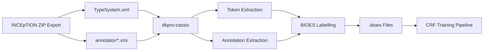

# CAS XMI to BIOES Converter

`cas_to_bioes.py` converts INCEpTION CAS XMI annotation exports into BIOES-tagged token sequences for CRF model training. It bridges the annotation tool (INCEpTION) and the machine learning pipeline (sklearn-crfsuite).

## BIOES Labelling Scheme

| Tag | Meaning | Example |
|-----|---------|---------|
| **B** | Beginning of a multi-token entity | `B-BIB` (start of "Rom. 5") |
| **I** | Inside a multi-token entity | `I-BIB` (the "." in "Rom. 5") |
| **O** | Outside any entity | `O` (plain text) |
| **E** | End of a multi-token entity | `E-BIB` (the "5" in "Rom. 5") |
| **S** | Single-token entity | `S-PAT` (standalone "Augustinus") |

## Usage

### From INCEpTION ZIP export

```bash
cd 03_prototype/stockel_annotation
python scripts/cas_to_bioes.py <zip_file> <annotator_username>
```

INCEpTION ZIP exports contain a `TypeSystem.xml` and per-annotator XMI files. The script reads both, tokenizes the text, and applies BIOES labels based on annotation spans.

### From a single XMI file

```bash
python scripts/cas_to_bioes.py --from-xmi document.xmi --typesystem TypeSystem.xml
```

### Options

| Flag | Default | Description |
|------|---------|-------------|
| `--output-dir` | `data/bioes/` | Directory for output `.bioes` files |
| `--annotation-types` | See below | UIMA type names to extract |
| `--type-feature` | Auto-detect | Feature name for entity label (e.g., `Tipo`) |

## Supported Annotation Types

The converter handles both GNORM legal annotations and Stöckel theological annotations:

| Source | Annotation Type | Short Label |
|--------|----------------|-------------|
| GNORM | `Allegazione normativa` | `AN` |
| GNORM | `Lemma glossato` | `LEMMA` |
| GNORM | `Capitolo` | `CHAPTER` |
| GNORM | `Titolo` | `TITLE` |
| Stöckel | `Biblical reference` | `BIB` |
| Stöckel | `Patristic reference` | `PAT` |
| Stöckel | `Reformation reference` | `REF` |

## Output Format

One `.bioes` file per input document. Sentences are separated by blank lines:

```
Quod 0 4 O
est 5 8 O
in 9 11 B-AN
c 12 13 I-AN
. 13 14 I-AN
1 15 16 E-AN

Sicut 17 22 O
ait 23 26 O
Rom 27 30 B-BIB
. 30 31 I-BIB
5 32 33 E-BIB
```

## Architecture



## Dependencies

Requires `dkpro-cassis >= 0.9.0`:

```bash
pip install 'itserr-agent[annotation]'
```

## Test Suite

48 unit tests cover all core logic without requiring dkpro-cassis:

```bash
cd 03_prototype
python -m pytest tests/test_cas_to_bioes.py -v
```

Tests cover tokenization, BIOES label assignment (S, B-I-E, multi-entity, edge cases), label normalization, sentence grouping, output formatting, and end-to-end conversion with GNORM-style examples.
