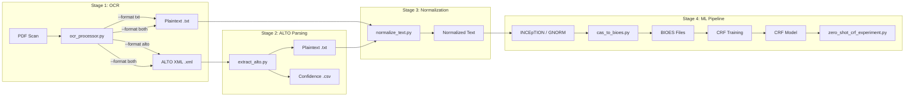

# OCR Pipeline Overview

The project includes a two-stage OCR pipeline for extracting structured text from 16th-century PDF scans, designed specifically for Latin theological texts.

## Pipeline Architecture



## Why Two Stages?

The pipeline separates OCR extraction from ALTO parsing for several reasons:

1. **Flexibility** — Run OCR once, parse ALTO multiple times with different settings (page ranges, confidence thresholds)
2. **Confidence data** — ALTO XML preserves per-word OCR confidence scores that plaintext discards
3. **Quality auditing** — Low-confidence words can be flagged for manual review before annotation
4. **Re-extraction** — If normalization rules change, re-parse from ALTO XML without re-running OCR

## Components

| Script | Input | Output | Purpose |
|--------|-------|--------|---------|
| [`ocr_processor.py`](ocr-processor.md) | PDF | `.txt` and/or `.xml` | Tesseract OCR with Latin support |
| [`extract_alto.py`](extract-alto.md) | ALTO XML | `.txt` + `.csv` | Parse structured XML, extract confidence |
| [`normalize_text.py`](normalize-text.md) | Plaintext | Normalized text | Latin-specific normalization |
| [`cas_to_bioes.py`](cas-to-bioes.md) | CAS XMI (ZIP) | `.bioes` files | INCEpTION export → BIOES for CRF |
| [`zero_shot_crf_experiment.py`](zero-shot-experiment.md) | CRF model + text | Report + TSV | Cross-domain transfer experiment |

## Quick Start

```bash
cd 03_prototype/stockel_annotation

# Extract text and ALTO XML from a PDF
python scripts/ocr_processor.py --format both --pages 1-10

# Parse ALTO XML with confidence scores
python scripts/extract_alto.py data/alto/ -o data/cleaned/ --export-confidence

# Normalize the extracted text
python scripts/normalize_text.py
```

## Test Coverage

All pipeline components have comprehensive test suites that run without external dependencies (Tesseract, PDF files):

| Test Suite | Tests | File |
|------------|-------|------|
| Text normalizer | 111 | `tests/test_normalize_text.py` |
| ALTO parser | 55 | `tests/test_extract_alto.py` |
| Zero-shot CRF experiment | 49 | `tests/test_zero_shot_crf.py` |
| CAS → BIOES converter | 48 | `tests/test_cas_to_bioes.py` |
| OCR processor | 34 | `tests/test_ocr_processor.py` |
| GNORM client | 18 | `tests/test_gnorm.py` |
| Integration | 17 | `tests/test_integration.py` |
| Memory streams | 17 | `tests/test_streams.py` |
| Reflection | 14 | `tests/test_reflection.py` |
| Epistemic classifier | 13 | `tests/test_epistemic.py` |
| **Total** | **376** | |

Run all tests:

```bash
cd 03_prototype
python -m pytest tests/ -v
```

## Dependencies

The OCR pipeline requires both **Python packages** and **system applications**. The system applications (Tesseract, Poppler) must be installed first since the Python packages are only wrappers around them.

!!! tip "Tests run without system dependencies"
    All 376 tests mock external dependencies and run without Tesseract, Poppler, dkpro-cassis, or sklearn-crfsuite installed. You only need the optional packages to process actual data.

### Step 1: Install System Applications

#### Tesseract OCR (required for `ocr_processor.py`)

=== "Windows"

    1. Download the installer from [UB Mannheim Tesseract builds](https://github.com/UB-Mannheim/tesseract/wiki)
    2. Run the `.exe` installer
    3. During setup, expand **Additional language data** and check **Latin** (`lat`)
    4. Note the install path (default: `C:\Program Files\Tesseract-OCR`)
    5. Add Tesseract to your system PATH:
        - Open **Settings** → **System** → **About** → **Advanced system settings** → **Environment Variables**
        - Under **Path**, click **Edit** → **New** → add `C:\Program Files\Tesseract-OCR`
    6. Verify: open a new terminal and run `tesseract --version`

    !!! note "Alternative: set path in Python"
        If you don't want to modify PATH, you can set it per-script:
        ```python
        import pytesseract
        pytesseract.pytesseract.tesseract_cmd = r'C:\Program Files\Tesseract-OCR\tesseract.exe'
        ```

=== "Ubuntu/Debian"

    ```bash
    sudo apt-get update
    sudo apt-get install tesseract-ocr tesseract-ocr-lat
    ```

=== "macOS"

    ```bash
    brew install tesseract
    brew install tesseract-lang  # Includes Latin and other language packs
    ```

#### Poppler (required for `pdf2image` in `ocr_processor.py`)

Poppler converts PDF pages to images. The Python `pdf2image` package requires it.

=== "Windows"

    **Option A: Conda (recommended if you use Anaconda/Miniconda)**
    ```bash
    conda install -c conda-forge poppler
    ```

    **Option B: Manual install**

    1. Download the latest release from [poppler-windows](https://github.com/oschwartz10612/poppler-windows/releases)
    2. Extract the archive (e.g., to `C:\poppler`)
    3. Add the `bin\` folder to your system PATH (e.g., `C:\poppler\Library\bin`)
    4. Verify: open a new terminal and run `pdfinfo -v`

=== "Ubuntu/Debian"

    ```bash
    sudo apt-get install poppler-utils
    ```

=== "macOS"

    ```bash
    brew install poppler
    ```

### Step 2: Install Python Packages

From the `03_prototype` directory:

```bash
cd 03_prototype
pip install pytesseract pdf2image Pillow lxml
```

| Package | Version | Purpose |
|---------|---------|---------|
| `pytesseract` | >= 0.3.8 | Python Tesseract wrapper (ALTO XML requires 0.3.8+) |
| `pdf2image` | any | PDF to image conversion (requires Poppler) |
| `Pillow` | any | Image processing |
| `lxml` | any | XML parsing for `extract_alto.py` |

### Step 3: Verify Installation

```bash
# Check Tesseract is available
tesseract --version

# Check Latin language pack is installed
tesseract --list-langs | grep lat

# Check Poppler is available
pdfinfo -v

# Quick Python check
python -c "import pytesseract; print(pytesseract.get_tesseract_version())"
```
