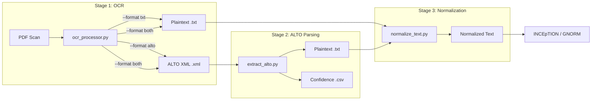

# OCR Pipeline Overview

The project includes a two-stage OCR pipeline for extracting structured text from 16th-century PDF scans, designed specifically for Latin theological texts.

## Pipeline Architecture



## Why Two Stages?

The pipeline separates OCR extraction from ALTO parsing for several reasons:

1. **Flexibility** — Run OCR once, parse ALTO multiple times with different settings (page ranges, confidence thresholds)
2. **Confidence data** — ALTO XML preserves per-word OCR confidence scores that plaintext discards
3. **Quality auditing** — Low-confidence words can be flagged for manual review before annotation
4. **Re-extraction** — If normalization rules change, re-parse from ALTO XML without re-running OCR

## Components

| Script | Input | Output | Purpose |
|--------|-------|--------|---------|
| [`ocr_processor.py`](ocr-processor.md) | PDF | `.txt` and/or `.xml` | Tesseract OCR with Latin support |
| [`extract_alto.py`](extract-alto.md) | ALTO XML | `.txt` + `.csv` | Parse structured XML, extract confidence |
| [`normalize_text.py`](normalize-text.md) | Plaintext | Normalized text | Latin-specific normalization |

## Quick Start

```bash
cd 03_prototype/stockel_annotation

# Extract text and ALTO XML from a PDF
python scripts/ocr_processor.py --format both --pages 1-10

# Parse ALTO XML with confidence scores
python scripts/extract_alto.py data/alto/ -o data/cleaned/ --export-confidence

# Normalize the extracted text
python scripts/normalize_text.py
```

## Test Coverage

All pipeline components have comprehensive test suites that run without external dependencies (Tesseract, PDF files):

| Test Suite | Tests | File |
|------------|-------|------|
| OCR processor | 34 | `tests/test_ocr_processor.py` |
| ALTO parser | 55 | `tests/test_extract_alto.py` |
| Text normalizer | 74 | `tests/test_normalize_text.py` |
| **Total** | **163** | |

Run all tests:

```bash
cd 03_prototype
python -m pytest tests/ -v
```

## Dependencies

| Package | Purpose | Required For |
|---------|---------|-------------|
| `pytesseract` >= 0.3.8 | Python Tesseract wrapper | OCR processor (ALTO requires 0.3.8+) |
| `pdf2image` | PDF to image conversion | OCR processor |
| `Pillow` | Image processing | OCR processor |
| `lxml` | XML parsing | ALTO parser |
| `tesseract-ocr` | OCR engine (system package) | OCR processor |
| `tesseract-ocr-lat` | Latin language data | OCR processor |

Install Python dependencies:

```bash
pip install pytesseract pdf2image Pillow lxml
```

Install Tesseract (system package):

```bash
# Ubuntu/Debian
sudo apt-get install tesseract-ocr tesseract-ocr-lat

# macOS
brew install tesseract tesseract-lang
```
