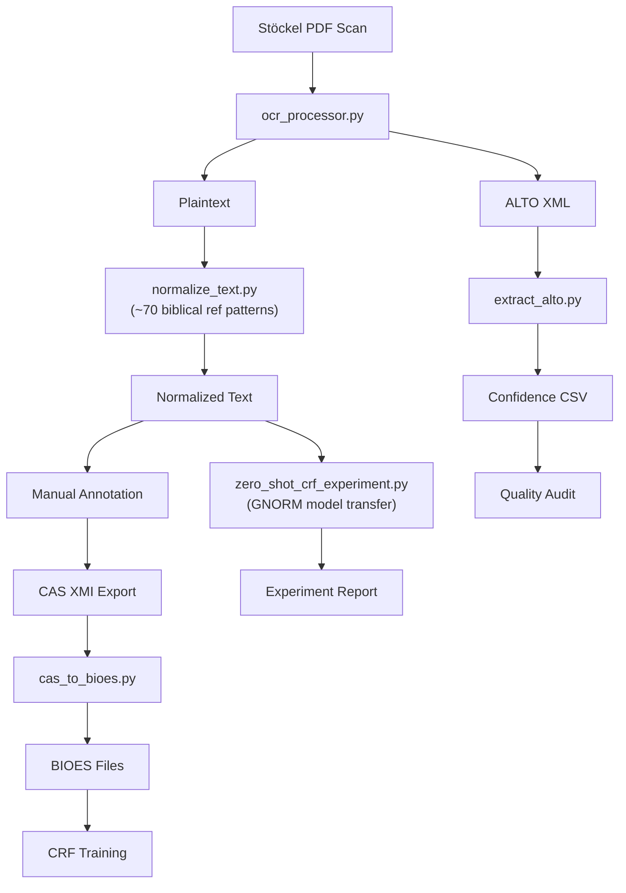

# Stöckel Annotation Pilot Study

Testing whether GNORM's CRF-based annotation approach can generalize from medieval canon law to 16th-century Reformation theological texts.

## Research Question

**Can GNORM's CRF approach generalize to 16th-century Protestant theological texts?**

## Why Stöckel?

Leonard Stöckel's *Annotationes in Locos communes* (1561) is an ideal test case:

1. **Dense Citation Networks** — Extensive references to Patristic, Biblical, Classical, and Reformation sources
2. **Structural Similarity** — Medieval glosses and Reformation commentaries share abbreviated citation formats, marginal apparatus structures, and *allegationes* logic
3. **Research Gap** — No automated annotation system exists for Reformation-era theological commentaries

## Selected Test Chapters

| Text | Date | Genre | Est. Citations | Status |
|------|------|-------|----------------|--------|
| *De Peccato Originis* | 1561 | Commentary | 40-60 | OCR complete |
| *De Iustificatione* | 1561 | Commentary | 50-70 | OCR complete |
| *De Lege et Evangelio* | 1561 | Commentary | 35-50 | OCR complete |

## Pipeline Status

### Completed

- [x] Full OCR extraction (57 pages, 18,912 words) via [`ocr_processor.py`](ocr-processor.md)
- [x] ALTO XML output with per-word confidence scores
- [x] Text normalization (long-s, abbreviations, structural marking) via [`normalize_text.py`](normalize-text.md)
- [x] Expanded biblical reference detection (~70 patterns covering the full canon) with period/colon separator support
- [x] 8 chapters identified: PRAEFATIO through DE LEGE
- [x] INCEpTION annotation tool configured with custom layers
- [x] [`cas_to_bioes.py`](cas-to-bioes.md) — CAS XMI → BIOES converter for CRF training
- [x] [`zero_shot_crf_experiment.py`](zero-shot-experiment.md) — Cross-domain CRF experiment framework
- [x] `build_corpus_json.py` — Corpus Browser data generator with detection provenance and epistemic classification
- [x] 414 unit tests across 11 test suites

### In Progress

- [ ] Manual annotation in INCEpTION (target: 100+ references)
- [ ] Integration testing with live GNORM API
- [ ] Annotation schema formalization
- [ ] Running zero-shot CRF experiment with trained GNORM model

### Planned Experiments

**Experiment 1: Direct Transfer**
Run GNORM's trained CRF model on Stöckel text (zero-shot). Hypothesis: will identify some patristic citations but miss biblical references.

**Experiment 2: Retrained CRF**
Train a new CRF using manual Stöckel annotations. Compare simple vs. rich feature configurations against GNORM's *Liber Extra* baseline.

**Experiment 3: Hybrid Approach**
Combine GNORM's pre-trained features with domain-specific additions. Test whether knowledge transfer from canon law helps.

## Annotation Schema

Adapted from GNORM for theological texts:

| Entity Type | GNORM Equivalent | Stöckel Application |
|-------------|------------------|---------------------|
| Glossed lemma | `Lemma glossato` | Commented biblical/theological term |
| Legal reference | `Allegazione normativa` | Patristic/biblical citation |
| Title | `Titolo` | Work referenced (e.g., *De Civitate Dei*) |
| Chapter | `Capitolo` | Specific passage location |
| **NEW:** Biblical reference | — | Scripture citations (book:chapter:verse) |
| **NEW:** Contemporary reference | — | Reformation-era sources (Luther, Melanchthon) |

## Data Flow

## Progress Tracking

See [`PROGRESS.md`](https://github.com/michalvalco/ITSERR-RESILIENCE-Project/blob/main/03_prototype/stockel_annotation/PROGRESS.md) for detailed task tracking and weekly check-in logs.
