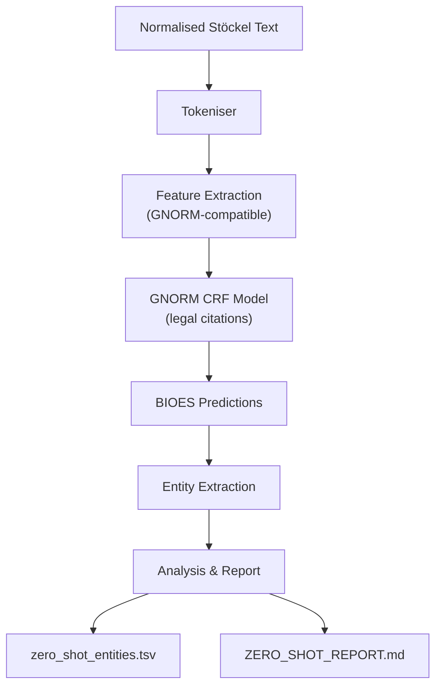

# Zero-Shot CRF Experiment

`zero_shot_crf_experiment.py` runs the GNORM legal-citation CRF model on Stöckel's theological text without any theological training data — a cross-domain transfer experiment.

## Research Question

**Can a model trained on 13th-century Latin legal citations recognise 16th-century Latin biblical citations?**

Both domains share structural patterns:

| Feature | GNORM (Legal) | Stöckel (Theological) |
|---------|---------------|----------------------|
| Abbreviation + number | `c. 12`, `q. 1` | `Rom. 5`, `Gen. 3` |
| Separator punctuation | periods, colons | periods, colons |
| Titlecase abbreviations | `X`, `C`, `Decret.` | `Matt.`, `Psalm.`, `Act.` |
| Clustered references | `28. q. 1 § quod` | `Actor: 20. 1. Cor: 16` |
| Context patterns | `in c. ...`, `ut in ...` | `sicut ait ...`, `iuxta ...` |

The hypothesis is that character-level and word-shape features (digits, periods, titlecase) transfer across domains, even though the vocabulary does not.

## Usage

### Feature extraction demo (no model needed)

```bash
cd 03_prototype/stockel_annotation
python scripts/zero_shot_crf_experiment.py --feature-demo
```

This shows what features the CRF pipeline extracts from your normalised Stöckel text — useful for understanding what the model sees.

### Full experiment (requires trained model)

```bash
python scripts/zero_shot_crf_experiment.py model.pkl
```

| Flag | Default | Description |
|------|---------|-------------|
| `--input-dir` | `data/normalized/` | Directory with normalised text files |
| `--output-dir` | `data/zero_shot_results/` | Directory for results |
| `--feature-demo` | — | Show feature extraction only |

## CRF Features

The feature extraction replicates the GNORM `train_crfsuite.py` pipeline:

| Feature | Description |
|---------|-------------|
| `word.lower()` | Lowercase token text |
| `word.isupper()` | All uppercase? |
| `word.istitle()` | Title case? (key for abbreviations) |
| `word.isdigit()` | All digits? (key for chapter/verse numbers) |
| `word.has_period` | Contains a period? |
| `word.has_colon` | Contains a colon? |
| `word[-3:]`, `word[:3]` | Character n-gram suffixes/prefixes |
| Context ±6 tokens | Same features for surrounding tokens |
| `BOS`, `EOS` | Sentence boundary markers |

## Output

### `zero_shot_entities.tsv`

Tab-separated file with every entity the model found:

| Column | Description |
|--------|-------------|
| `file` | Source text file |
| `entity_text` | The text span the model labelled as an entity |
| `label` | Entity type (from the GNORM label vocabulary) |
| `is_biblical` | Heuristic: does this look like a biblical reference? |
| `context` | Surrounding text for manual inspection |

### `ZERO_SHOT_REPORT.md`

Summary report with:

- Token and entity counts
- Annotation density (% of tokens labelled as entities)
- Biblical reference overlap analysis
- Most frequent entity texts
- Interpretation of cross-domain transfer results

## Architecture



## Dependencies

Requires `sklearn-crfsuite >= 0.3.6` for model loading:

```bash
pip install 'itserr-agent[annotation]'
```

The `--feature-demo` mode works without sklearn-crfsuite.

## Test Suite

48 unit tests cover all core components:

```bash
python -m pytest tests/test_zero_shot_crf.py -v
```

Tests cover tokenization, feature extraction, BIOES entity extraction, context windowing, biblical reference heuristics, and end-to-end pipeline integration.
