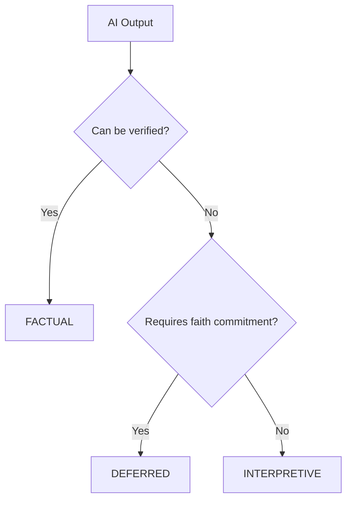

# Epistemic Modesty Framework

A detailed exploration of the epistemic modesty framework implemented in the ITSERR Agent.

## The Problem of AI Certainty

Contemporary AI systems present responses with uniform confidence, regardless of the epistemic status of their claims. This creates several problems:

### 1. Category Confusion

AI outputs conflate:

- **Empirical facts** (verifiable against sources)
- **Interpretive claims** (requiring scholarly judgment)
- **Normative assertions** (requiring ethical/theological commitment)

### 2. False Authority

Users may accept AI outputs as authoritative when they are:

- Plausible but unverified
- Derived from contested interpretations
- Beyond AI competence (e.g., theological truth)

### 3. Diminished Researcher Agency

When AI presents interpretations as facts, researchers may:

- Fail to verify claims
- Neglect alternative readings
- Outsource judgment inappropriately

## The Epistemic Modesty Solution

### Core Principle

> Every AI claim should be marked according to its epistemic status.

### Three-Tier Classification



## FACTUAL Claims

### Definition

Information that can be verified against authoritative sources.

### Characteristics

- **Source attribution** (author, work, page)
- **Scholarly consensus** (where applicable)
- **Empirical verifiability** (dates, places, names)

### Examples

```
[FACTUAL] The Council of Nicaea convened in 325 CE under Emperor Constantine.

[FACTUAL] Luther's 95 Theses were posted on October 31, 1517.

[FACTUAL] According to Aquinas (ST I, q.2, a.3), the existence of God can be demonstrated in five ways.
```

### Agent Behavior

- Provide citations where possible
- Note scholarly consensus when relevant
- Acknowledge disputed facts

## INTERPRETIVE Claims

### Definition

AI-assisted analysis that requires researcher verification.

### Characteristics

- **Pattern recognition** (themes, structures)
- **Comparative observations** (similarities, differences)
- **Tentative connections** (possible influences)

### Examples

```
[INTERPRETIVE] There appears to be a structural parallel between Paul's Adam-Christ typology in Romans 5 and the Second Temple Jewish concept of the two Adams.

[INTERPRETIVE] Calvin's emphasis on divine sovereignty seems to intensify in his later writings, possibly reflecting his experiences in Geneva.

[INTERPRETIVE] The frequency of "covenant" language in this text suggests the author may be working within a federal theology framework.
```

### Agent Behavior

- Use hedging language ("appears," "suggests," "may")
- Invite researcher verification
- Note alternative interpretations

## DEFERRED Claims

### Definition

Matters requiring human theological, ethical, or spiritual judgment.

### Characteristics

- **Truth claims** about divine reality
- **Value judgments** about religious practices
- **Contested interpretations** with confessional stakes
- **Spiritual discernment** matters

### Examples

```
[DEFERRED] Whether the doctrine of double predestination is a faithful reading of Scripture is a matter requiring theological judgment that I cannot make.

[DEFERRED] The spiritual efficacy of this sacramental practice cannot be assessed through AI analysis.

[DEFERRED] Which christological formulation best captures the mystery of the Incarnation is a question for theological reflection, not AI determination.
```

### Agent Behavior

- Explicitly decline to judge
- Present multiple perspectives
- Invite researcher reflection

## Classification Confidence

Each classification carries a confidence score (0.0 to 1.0):

### High Confidence (≥ 0.85)

- Clear citations present
- Unambiguous factual content
- Standard classification patterns

### Medium Confidence (0.5 - 0.85)

- Some markers present
- Context-dependent interpretation
- Borderline cases

### Low Confidence (< 0.5)

- Few classification markers
- Ambiguous content
- Flagged for human review

## Boundary Cases

### Scholarly Consensus

When scholars disagree on facts:

```
[FACTUAL] The traditional dating of Mark's Gospel is c. 65-70 CE, though some scholars argue for an earlier date.
```

### Interpretation Presented as Fact

Guard against:

```
# WRONG: Presenting interpretation as fact
[FACTUAL] Paul's theology is fundamentally about justification by faith.

# RIGHT: Marking as interpretation
[INTERPRETIVE] A significant strand of Pauline scholarship reads Paul's theology primarily through the lens of justification.
```

### Theological Claims with Historical Dimension

```
[FACTUAL] The Nicene Creed affirms that Christ is "of one Being with the Father."
[DEFERRED] Whether this formulation adequately expresses the biblical witness is a matter of theological judgment.
```

## Implementation Strategies

### 1. LLM Instruction

The system prompt explicitly instructs classification:

```
Always classify your responses using these indicators:
- [FACTUAL]: Verifiable information with citations
- [INTERPRETIVE]: AI-assisted analysis requiring verification
- [DEFERRED]: Matters requiring human judgment
```

### 2. Post-Processing Classification

Rule-based classifier validates and supplements:

```python
def classify_sentence(self, sentence: str) -> EpistemicIndicator:
    # Check for citations → FACTUAL
    # Check for normative language → DEFERRED
    # Check for interpretive markers → INTERPRETIVE
    # Default → configured default (usually INTERPRETIVE)
```

### 3. Confidence Calibration

External tools (like GNORM) provide confidence scores that map to indicators:

```python
if confidence >= 0.85:
    return IndicatorType.FACTUAL
else:
    return IndicatorType.INTERPRETIVE
```

## Evaluation Criteria

### Precision

Are claims correctly classified?

- Factual claims should be verifiable
- Interpretive claims should be marked as tentative
- Deferred claims should be genuine judgment matters

### Coverage

Are all claims classified?

- No unmarked assertions
- Consistent application across responses
- Clear boundaries between categories

### Usefulness

Does classification aid the researcher?

- Clear guidance on verification needs
- Appropriate deference to human judgment
- Support for scholarly rigor

## Limitations

### Training Data Influence

The AI's interpretations are influenced by:

- Scholarly perspectives in training data
- Potential biases toward certain traditions
- Limitations of pattern recognition

### Dynamic Scholarship

Scholarly consensus evolves:

- New discoveries may shift "factual" status
- Interpretive frameworks change
- The agent's training has a cutoff date

### Simplification Risk

Three categories simplify complex epistemic terrain:

- Some claims span categories
- Confidence is itself uncertain
- Context matters for classification

## Future Directions

- **Finer-grained categories** for specific theological domains
- **User-defined thresholds** for confidence levels
- **Learning from corrections** to improve classification
- **Tradition-specific modes** for confessional contexts
